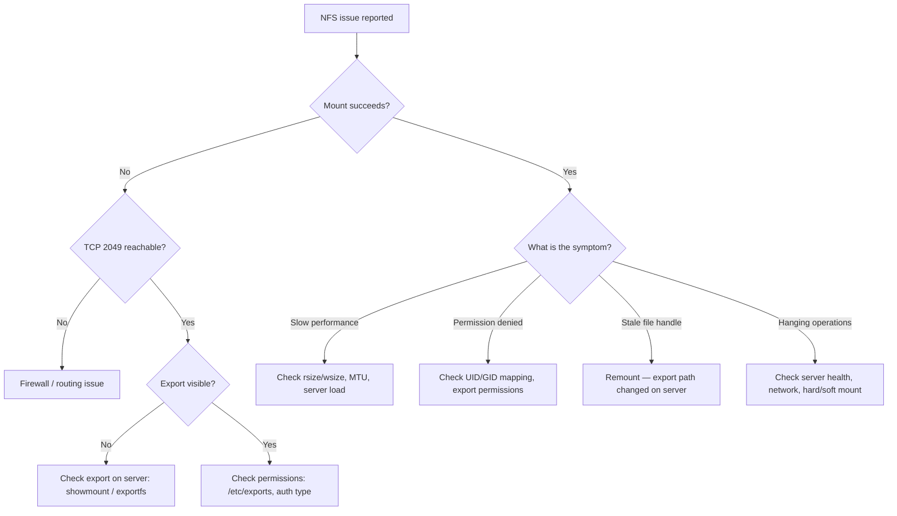

---
tags:
  - networking
  - troubleshooting
---
# NFS Troubleshooting


<div class="kb-summary">
NFS Troubleshooting reference covering Diagnostic Flow, Quick Diagnostics, Common Issues, Performance Tuning, Export Configuration Reference and 2 more sections.
</div>

```text
┌───────────────────────────────────────────────────────────────────────────────────────────────────────┐
│  1. nc -zv <server> 2049 ── fail ──► firewall / routing                                               │
│          │ ok                                                                                         │
│          ▼                                                                                            │
│  2. showmount -e <server> ─ no export ► check /etc/exports                                            │
│          │ export visible                                                                             │
│          ▼                                                                                            │
│  3. Mount attempt fails? ── yes ───► check export ACL (IP)                                            │
│          │ mounts ok                                                                                  │
│          ▼                                                                                            │
│  4. Stale file handle? ──── yes ───► umount -l; remount                                               │
│          │ no                                                                                         │
│          ▼                                                                                            │
│  5. Permission denied? ──── yes ───► check UID/GID mapping                                            │
│          │ no                        check root_squash                                                │
│          ▼                                                                                            │
│  6. Check server exports & network (nfsstat -c for retrans)                                           │
└───────────────────────────────────────────────────────────────────────────────────────────────────────┘
```

## Before you begin

- **Access:** Network admin credentials; console or SSH to devices
- **Gather first:** recent error message text, event timestamps, and affected object names
- **Scope:** confirm whether the issue affects a single object, host, cluster, or site
- **Escalation:** open a vendor support ticket before running any destructive step
- **Logging:** document each command and output — required if escalation is needed

---

## Diagnostic Flow



## Quick Diagnostics

```bash
# Test connectivity to NFS port
nc -zv <nfs-server> 2049

# Show server exports (from client)
showmount -e <nfs-server>

# Check server-side exports
exportfs -v

# Show active NFS mounts on client
mount | grep nfs
nfsstat -m

# NFS client statistics (retransmits, errors)
nfsstat -c

# NFS server statistics
nfsstat -s

# RPC service availability (NFSv3)
rpcinfo -p <nfs-server>
```

## Common Issues

| Symptom | Probable cause | Resolution |
|---|---|---|
| `mount: no route to host` | Firewall blocking 2049 | Open TCP/UDP 2049 (and 111 for NFSv3) |
| `access denied by server` | Client IP not in export ACL | Update `/etc/exports`, run `exportfs -ra` |
| `Stale file handle` | Export path changed or server restarted | Unmount and remount |
| Files owned by `nobody` | NFSv4 idmapd domain mismatch | Match `Domain =` in `/etc/idmapd.conf` on client and server |
| `Permission denied` on read/write | UID mismatch or `root_squash` | Use `no_root_squash` for admin mounts; verify UIDs match |
| Mount hangs indefinitely | `hard` mount + server unreachable | Investigate server; use `intr` option for admin mounts |
| Slow performance | Default rsize/wsize (4K) | Set `rsize=1048576,wsize=1048576` in mount options |
| Kerberos auth fails | Clock drift > 5s | Fix NTP; `klist` to check Kerberos ticket |

## Performance Tuning

```bash
# Recommended mount options for throughput
mount -t nfs -o vers=4.1,hard,timeo=600,rsize=1048576,wsize=1048576,nconnect=8 \
  <server>:/export /mnt

# nconnect=N — use N TCP connections (Linux 5.3+, improves parallel throughput)

# Check current I/O sizes in use
nfsstat -m | grep rsize

# Test NFS throughput
dd if=/dev/zero of=/mnt/testfile bs=1M count=1000 oflag=direct
```

## Export Configuration Reference

```bash
# /etc/exports syntax
/data/exports   10.0.0.0/8(rw,sync,no_subtree_check,no_root_squash)
/data/readonly  *(ro,sync,no_subtree_check)

# Apply changes
exportfs -ra

# Verify active exports
exportfs -v

# Unexport and re-export all
exportfs -ua && exportfs -a
```

## Stale File Handle Recovery

```bash
# Unmount (force if stuck)
umount -l /mnt/data   # lazy unmount — detaches immediately

# Re-establish mount
mount -t nfs -o vers=4.1 <server>:/export /mnt/data

# If mount is hung and blocking
fuser -mk /mnt/data    # kill processes using the mountpoint
umount -f /mnt/data
```

## Log Locations

| Platform | Log |
|---|---|
| RHEL/Rocky client | `journalctl -u nfs-client.target` |
| RHEL/Rocky server | `journalctl -u nfs-server` |
| NetApp ONTAP | `event log show -messagename nfs*` |
| Kernel messages | `dmesg | grep -i nfs` |
