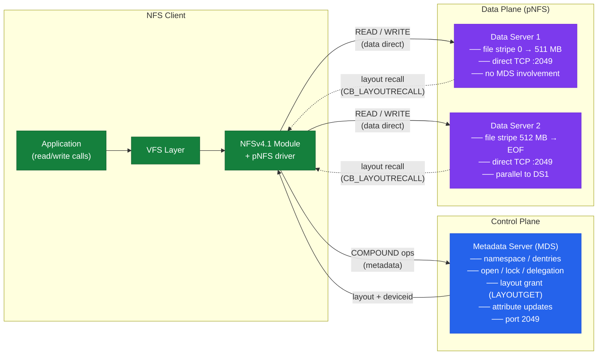

---
tags:
  - networking
---
# NFS Versions

<div class="kb-summary">
NFS Versions reference covering Version Comparison, Recommended Version, Checking NFS Version in Use, Configuring NFS Version, NFSv4 ID Mapping and 1 more sections.
</div>

        NFSv3 vs NFSv4 vs NFSv4.1 COMPARISON

## NFSv4.1 Session Model and pNFS Data Path

NFSv4.1 introduces a formal session abstraction (replacing the stateless NFSv3 model) and pNFS, which separates metadata operations from bulk data I/O. The Metadata Server (MDS) handles namespace, locking, and layout grants; Data Servers (DS) serve actual file data directly to the client.

```mermaid
sequenceDiagram
    autonumber
    participant CLI as NFS Client<br/>(Linux kernel nfs module)
    participant MDS as Metadata Server (MDS)<br/>(NFS server — port 2049)
    participant DS1 as Data Server 1 (DS)<br/>(Storage node A)
    participant DS2 as Data Server 2 (DS)<br/>(Storage node B)

    Note over CLI,MDS: Phase 1 — NFSv4.1 Session Establishment
    CLI->>MDS: EXCHANGE_ID (client owner, flags: SUPP_MOVED_REFER | USE_PNFS_MDS)
    MDS-->>CLI: EXCHANGE_ID response (clientid, server owner, sequence window)
    CLI->>MDS: CREATE_SESSION (clientid, sequence, channel attrs: max ops, slots)
    MDS-->>CLI: CREATE_SESSION response (sessionid, slot table size, max request size)
    Note over CLI,MDS: Slot-based session replaces RPC request-response<br/>Each slot tracks sequence — enables exactly-once semantics

    Note over CLI,MDS: Phase 2 — NFSv4.1 Compound Operations (metadata)
    CLI->>MDS: COMPOUND [ SEQUENCE | PUTROOTFH | LOOKUP "data" | GETATTR ]
    MDS-->>CLI: COMPOUND response (fh, attrs: size, mtime, mode, ACL)
    CLI->>MDS: COMPOUND [ SEQUENCE | PUTFH | OPEN (file.vmdk, OPEN4_CREATE) | GETATTR ]
    MDS-->>CLI: COMPOUND response (stateid, open delegation if granted)
    Note over CLI: Client holds stateid — used for all lock/layout requests

    Note over CLI,MDS: Phase 3 — pNFS Layout Grant (LAYOUTGET)
    CLI->>MDS: COMPOUND [ SEQUENCE | PUTFH | LAYOUTGET (type=FILE, offset=0, length=EOF) ]
    MDS-->>CLI: COMPOUND response — layout: DS1 handles stripe 0..511MB, DS2 handles 512MB..EOF<br/>deviceid → DS1 addr (10.0.1.11:2049), DS2 addr (10.0.1.12:2049)
    Note over CLI: Client now has full layout — MDS not in I/O path

    Note over CLI,DS1,DS2: Phase 4 — Direct Client-to-DS I/O (pNFS data path)
    CLI->>DS1: COMPOUND [ SEQUENCE | PUTFH | READ offset=0 count=4MB ]
    DS1-->>CLI: READ response (data, eof=false)
    CLI->>DS2: COMPOUND [ SEQUENCE | PUTFH | WRITE offset=512MB count=4MB ]
    DS2-->>CLI: WRITE response (count, verifier)
    Note over CLI,DS2: MDS receives NO data plane traffic<br/>Both DSes serve I/O in parallel → aggregate bandwidth

    Note over CLI,MDS: Phase 5 — Layout Return and State Cleanup
    CLI->>MDS: COMPOUND [ SEQUENCE | PUTFH | LAYOUTRETURN (stateid, range) ]
    MDS-->>CLI: COMPOUND response (layout returned)
    CLI->>MDS: COMPOUND [ SEQUENCE | PUTFH | CLOSE (stateid) ]
    MDS-->>CLI: COMPOUND response (stateid invalidated)
    CLI->>MDS: DESTROY_SESSION (sessionid)
    MDS-->>CLI: DESTROY_SESSION response
```

### MDS vs DS Role Separation



| Concept | NFSv3 | NFSv4.0 | NFSv4.1 |
|---|---|---|---|
| Session | None (stateless) | None (pseudo-stateful) | Formal session (sessionid + slot table) |
| Exactly-once semantics | No | No | Yes (slot sequence numbers) |
| pNFS | No | No | Yes — FILE, BLOCK, OBJECT layouts |
| Metadata server | Combined | Combined | Dedicated MDS role |
| Data path | Always through server | Always through server | Direct client → DS (bypasses MDS) |
| Callback channel | Separate connection | Single forward channel | Backchannel on same session |

## Version Comparison

| Feature | NFSv3 | NFSv4 | NFSv4.1 |
|---|---|---|---|
| Transport | UDP or TCP | TCP only | TCP only |
| Stateful | No | Yes | Yes |
| Security | AUTH_SYS (UID/GID) | Kerberos, RPCSEC_GSS | Kerberos, RPCSEC_GSS |
| ACLs | No native ACLs | NFSv4 ACLs | NFSv4 ACLs |
| Locking | NLM (separate protocol) | Built-in | Built-in |
| Multipath (pNFS) | No | No | Yes (pNFS) |
| Port | 2049 + portmapper (111) | 2049 fixed | 2049 fixed |
| ID mapping | UID/GID numbers | user@domain strings | user@domain strings |

## Recommended Version

- **NFSv4.1** — preferred for new deployments. Stateful, single port (2049), pNFS capable, strongest security options.
- **NFSv3** — legacy compatibility only. Required for some storage arrays and older clients.
- **NFSv4.0** — functional but superseded; prefer 4.1.

## Checking NFS Version in Use

```bash
# Linux client — show mount options including NFS version
mount | grep nfs
# or
cat /proc/mounts | grep nfs

# Verbose mount info including vers=
nfsstat -m

# Server-side — which versions are enabled
cat /proc/fs/nfsd/versions

# Show active NFS connections and versions
ss -tnp | grep :2049
```


```text title="Expected output"
/mnt/data on 192.168.1.50:/export/data type nfs (rw,relatime,vers=4.1,addr=192.168.1.50,clientaddr=192.168.1.100)
/mnt/backup on 192.168.1.51:/export/backup type nfs4 (ro,relatime,vers=4.0,addr=192.168.1.51)

Server nfs v4: 1.0
Server nfs v3: 1.0
Server nfs v2: -1.0

-2 +3 +4 +4.1

LISTEN    0    64    0.0.0.0:2049    0.0.0.0:*    users:(("nfsd",pid=1247,fd=7),("nfsd",pid=1248,fd=7))
LISTEN    0    64       [::]:2049       [::]:*    users:(("nfsd",pid=1249,fd=8))
ESTAB     0    0    192.168.1.50:2049    192.168.1.100:54821    users:(("nfsd",pid=1247,fd=9))
ESTAB     0    0    192.168.1.50:2049    192.168.1.102:45632    users:(("nfsd",pid=1248,fd=10))
```

!!! warning "Common errors"
    **`grep: /proc/mounts: No such file or directory`** — Use `mount | grep nfs` instead, or verify /proc is mounted with `mount | grep proc`.
    **`command not found: nfsstat`** — Install nfs-utils package with `apt-get install nfs-utils` (Debian/Ubuntu) or `yum install nfs-utils` (RHEL/CentOS).
    **`cat: /proc/fs/nfsd/versions: No such file or directory`** — Ensure NFS server is running with `systemctl start nfs-server` and the nfsd module is loaded.
## Configuring NFS Version

### Mount — Client Side

```bash
# Force NFSv4.1
mount -t nfs -o vers=4.1,rw <server>:<export> /mnt/data

# Force NFSv3
mount -t nfs -o vers=3,tcp <server>:<export> /mnt/data

# Persistent in /etc/fstab
<server>:/export  /mnt/data  nfs  vers=4.1,hard,timeo=600,rsize=1048576,wsize=1048576  0 0
```


```text title="Expected output"
(no output — command completes silently)
(no output — command completes silently)
(no output — fstab entry added, will mount on next boot or `mount -a`)
```

!!! warning "Common errors"
    **`mount.nfs: mount point /mnt/data does not exist`** — Create the mount point directory with `mkdir -p /mnt/data` before running the mount command.
    **`mount.nfs: access denied by server while mounting <server>:<export>`** — Verify the NFS export is configured on the server and the client IP is listed in `/etc/exports`, then run `exportfs -ra` on the server.
    **`mount.nfs: No such file or directory`** — Confirm the export path `<export>` exists on the server and the `<server>` hostname/IP is resolvable; check with `showmount -e <server>`.
### NFS Server — Enable/Disable Versions (RHEL/Rocky)

```bash
# /etc/nfs.conf — set which versions the server offers
[nfsd]
vers3=n       # disable NFSv3
vers4=y
vers4.0=n     # disable NFSv4.0
vers4.1=y
vers4.2=y

systemctl restart nfs-server
cat /proc/fs/nfsd/versions
```


```text title="Expected output"
NFSD version support:
-2 -3 +4 +4.0 +4.1 +4.2
```

!!! warning "Common errors"
    **`systemctl restart nfs-server: Unit nfs-server.service not found.`** — Install the NFS server package with `apt install nfs-kernel-server` (Debian/Ubuntu) or `dnf install nfs-utils` (RHEL/CentOS).
    **`cat: /proc/fs/nfsd/versions: No such file or directory`** — The nfsd module is not loaded; run `modprobe nfsd` before restarting the service.
    **`Job for nfs-server.service failed because the control process exited with error code.`** — Check `/var/log/syslog` or `journalctl -xe` for syntax errors in `/etc/nfs.conf` (e.g., missing `[nfsd]` section header or invalid key names).
## NFSv4 ID Mapping

NFSv4 maps file ownership using `user@domain` strings instead of raw UID/GID. Misconfigured ID mapping causes files to appear as `nobody`.

```bash
# Check idmapd is running
systemctl status rpcidmapd

# /etc/idmapd.conf
[General]
Domain = example.com   # must match on client and server

# Flush ID mapping cache
nfsidmap -c
```


```text title="Expected output"
● rpcidmapd.service - NFSv4 ID Mapper
     Loaded: loaded (/usr/lib/systemd/system/rpcidmapd.service; enabled; vendor preset: enabled)
     Active: active (running) since Mon 2024-01-15 14:32:18 UTC; 2h 45min ago
       Docs: man:rpcidmapd(8)
    Process: 2847 ExecStart=/usr/sbin/rpcidmapd (code=exited, status=0/SUCCESS)
   Main PID: 2848 (rpcidmapd)
      Tasks: 1 (limit: 4915)
     Memory: 1.2M
        CPU: 12ms
     CGroup: /system.slice/rpcidmapd.service
             └─2848 /usr/sbin/rpcidmapd
(no output — command completes silently)
```

!!! warning "Common errors"
    **`systemctl status rpcidmapd`** — Start the service with `systemctl start rpcidmapd` and enable it with `systemctl enable rpcidmapd`.
    **`nfsidmap: error: unable to open /etc/idmapd.conf`** — Verify the idmapd.conf file exists at `/etc/idmapd.conf` and is readable by the rpcidmapd process.
    **`Domain mismatch: server domain 'example.com' does not match client domain 'internal.local'`** — Ensure the Domain parameter in `/etc/idmapd.conf` is identical on both NFS client and server, then restart rpcidmapd with `systemctl restart rpcidmapd`.
## Common Version-Related Issues

| Symptom | Cause | Check |
|---|---|---|
| Files owned by `nobody` | NFSv4 ID mapping mismatch | Verify `Domain =` in `/etc/idmapd.conf` matches on both sides |
| Mount hangs / slow | NFSv4 state recovery after server restart | Use `hard` mount option; check `nfsstat` for retries |
| Kerberos auth fails | Clock skew > 5 minutes | Verify NTP sync on client and server |
| NFSv3 locks not released | Stale NLM lock | `sm-notify` restart or server-side lock clear |
| Client defaults to NFSv3 | Default mount type | Explicitly specify `vers=4.1` in mount options |
