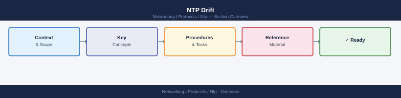

---
tags:
  - networking
---
# NTP Drift


<div class="kb-summary">
NTP Drift reference covering Drift Concepts, Reading Drift Values, Drift File, Interpreting Drift History, Drift After VM Operations and 1 more sections.
</div>



Clock drift is the natural tendency of a system clock to run fast or slow relative to real time. NTP continuously corrects drift by applying small frequency adjustments (slewing) to keep the clock accurate.

## Drift Concepts

| Term | Definition |
|---|---|
| **Drift / Frequency error** | How many parts-per-million (ppm) the clock runs fast or slow |
| **Offset** | The current difference between local clock and NTP source |
| **Slewing** | Gradually adjusting the clock rate to correct offset (max ~500ppm) |
| **Stepping** | Abrupt clock jump — used only when offset is too large to slew |
| **Drift file** | Saved frequency correction so the daemon starts with a good estimate |

1 ppm ≈ 0.0864 seconds per day. A 100 ppm drift = ~8.6 seconds per day without NTP.

## Reading Drift Values

```bash
# chronyc — frequency offset and skew
chronyc tracking | grep -E "Frequency|Skew|System time|Last offset"

# Example output:
# System time     :  0.000012345 seconds fast of NTP time
# Last offset     : +0.000001234 seconds
# Frequency       : 12.345 ppm fast   ← clock runs 12.345 ppm fast
# Skew            :  0.123 ppm        ← uncertainty in the frequency estimate
```

| Value | Healthy range | Concern |
|---|---|---|
| Frequency | ±500 ppm | > ±1000 ppm — hardware issue |
| Skew | < 10 ppm | > 100 ppm — few or unstable sources |
| System time offset | < 100ms | > 1s — risk of auth/Kerberos failures |

## Drift File

The drift file stores the last known frequency correction. On startup, the NTP daemon loads this value to avoid large initial offsets.

```bash
# chronyd drift file location
cat /var/lib/chrony/drift

# ntpd drift file location
cat /var/lib/ntp/drift

# Example content: a single floating-point number (ppm)
# 12.345678
```

If the drift file is deleted or corrupt, the daemon will start from zero correction and take longer to converge.

## Interpreting Drift History

```bash
# chronyc — show drift over time (last N measurements)
chronyc sourcestats

# Output columns: Name/IP, N, Polls, Reach, Last_Rx, Last sample, Est offset, Est error
```

## Drift After VM Operations

VMs commonly accumulate clock drift after:
- **Suspend/resume** — clock stops, then jumps on resume
- **vMotion** — minor timing discontinuity
- **High CPU load** — timer interrupts delayed

```bash
# Force immediate resync after VM resume
chronyc makestep

# Configure chrony to step on large offsets (in /etc/chrony.conf)
makestep 1.0 3   # step if offset > 1s on first 3 updates
```

## Windows Drift

```powershell
# Check frequency offset
w32tm /query /status | Select-String "Frequency"

# Adjust max drift allowed (registry)
# HKLM\SYSTEM\CurrentControlSet\Services\W32Time\Config\MaxPosPhaseCorrection
# HKLM\SYSTEM\CurrentControlSet\Services\W32Time\Config\MaxNegPhaseCorrection
# Default 54000 seconds (15 hours) — reduce for stricter environments
```
