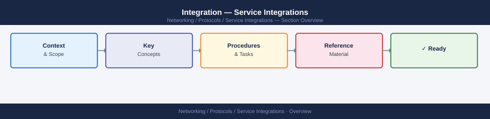

---
tags:
  - networking
---
# Integration — Service Integrations



```bash
# Prometheus: check scrape targets
curl -s http://prometheus:9090/api/v1/targets | jq '.data.activeTargets[] | {job:.labels.job, health:.health, error:.lastError}'

# Alertmanager: check alert routing
curl -s http://alertmanager:9093/api/v2/alerts | jq '.[] | {alertname:.labels.alertname, state:.status.state}'

# Grafana datasource health
curl -s -u admin:pass http://grafana:3000/api/datasources | jq '.[] | {name:.name, type:.type, url:.url}'
```

```bash
# SSSD on Linux
systemctl status sssd
sssctl domain-status <domain>
id <ad-user>               # should return AD UID + groups

# Winbind
wbinfo -t                  # test trust to domain
wbinfo -u | head -5        # list domain users
net ads info               # show DC and site info

# LDAP reachability
ldapsearch -x -H ldap://<dc-hostname> -b "dc=corp,dc=example,dc=com" "(sAMAccountName=testuser)" cn mail
```
```bash
# PgBouncer status
psql -h /tmp -p 6432 pgbouncer -c "SHOW POOLS;"
psql -h /tmp -p 6432 pgbouncer -c "SHOW STATS;"

# ProxySQL (MySQL)
mysql -h 127.0.0.1 -P 6032 -u admin -padmin -e "SELECT hostgroup_id, hostname, status FROM mysql_servers;"
```
```bash
# SSSD (re-read AD group membership)
sssctl cache-remove -y && systemctl restart sssd

# rsyslog
systemctl restart rsyslog && systemctl status rsyslog

# PgBouncer
systemctl restart pgbouncer && psql -h /tmp -p 6432 pgbouncer -c "SHOW POOLS;"

# Veeam agent
systemctl restart veeam
```
