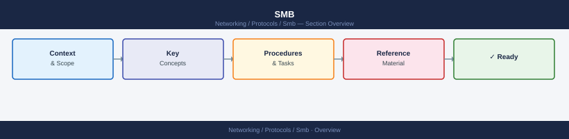

---
tags:
  - networking
---
# SMB

<div class="kb-summary">
Server Message Block (SMB) is a network file sharing protocol running over TCP port 445, used for file shares, printer sharing, and inter-process communication in Windows environments and increasingly in mixed Linux/macOS fleets via Samba. The critical operational concerns are version enforcement (SMB1 must be disabled; SMB3 is required for encryption and signing), the interaction between share permissions and NTFS permissions (most restrictive wins), and diagnosing authentication and session failures in domain environments.
</div>



<div class="kb-grid kb-grid-5">

<a class="kb-card" href="shares/">
  <strong>Shares</strong>
  <span>Creating and managing SMB shares, UNC paths, DFS namespaces, and share-level access control.</span>
</a>

<a class="kb-card" href="permissions/">
  <strong>Permissions</strong>
  <span>Share permissions vs NTFS permissions, most-restrictive-wins rule, and effective access evaluation.</span>
</a>

<a class="kb-card" href="sessions/">
  <strong>Sessions</strong>
  <span>Active session inspection, disconnected sessions, SMB signing, multichannel, and session limits.</span>
</a>

<a class="kb-card" href="ntfs/">
  <strong>NTFS</strong>
  <span>NTFS ACL inheritance, explicit vs inherited permissions, ownership, and icacls / Get-Acl management.</span>
</a>

<a class="kb-card" href="troubleshooting/">
  <strong>Troubleshooting</strong>
  <span>Access denied errors, credential caching issues, SMB dialect negotiation failures, and event log analysis.</span>
</a>

</div>

```d2
direction: right

center: "SMB" {shape: hexagon}
quick_reference: "Quick Reference" {shape: rectangle}
common_commands_config: "Common Commands / Config" {shape: rectangle}
troubleshooting: "Troubleshooting" {shape: rectangle}

center -> quick_reference
center -> common_commands_config
center -> troubleshooting
```

## Quick Reference

| Version | Status | Key features |
|---|---|---|
| SMB 1.0 | Disabled — remove it | No encryption, no signing by default; EternalBlue vulnerable |
| SMB 2.0 | Acceptable (Windows Vista+) | Pipelining, larger MTU, durable handles |
| SMB 2.1 | Acceptable (Windows 7+) | Opportunistic locking improvements |
| SMB 3.0 | Recommended (Windows 8+) | End-to-end encryption, SMB Multichannel |
| SMB 3.1.1 | Preferred (Windows 10+) | Pre-auth integrity check, AES-128-GCM encryption |

**Permission interaction (most restrictive wins):**

| Share permission | NTFS permission | Effective access |
|---|---|---|
| Full Control | Read | Read |
| Read | Full Control | Read |
| Full Control | Full Control | Full Control |
| Change | Modify | Modify |
| No access (Deny) | Full Control | No access |

**Key ports:**

| Port | Protocol | Purpose |
|---|---|---|
| 445/tcp | SMB direct | Primary — all modern SMB traffic |
| 139/tcp | NetBIOS session | Legacy only (SMB over NetBIOS) |
| 137–138/udp | NetBIOS | Name resolution — legacy |

## Common Commands / Config

```bash
# Windows: Test connectivity to SMB port (PowerShell)
Test-NetConnection -ComputerName <server> -Port 445

# Windows: Map a network drive
net use Z: \\<server>\<share> /user:<domain>\<username>
# Persistent:
net use Z: \\<server>\<share> /persistent:yes

# Windows: Disconnect a mapped drive
net use Z: /delete

# Windows: List all SMB shares on a server (PowerShell)
Get-SmbShare -CimSession <server>

# Windows: Create a new SMB share (PowerShell)
New-SmbShare -Name "Data" -Path "D:\Data" `
  -FullAccess "DOMAIN\Admins" -ReadAccess "DOMAIN\Users"

# Windows: Show active SMB sessions on a server
Get-SmbSession -CimSession <server>

# Windows: Check SMB signing and encryption settings
Get-SmbServerConfiguration | Select RequireSecuritySignature, EncryptData

# Windows: Enforce SMB signing (server-side)
Set-SmbServerConfiguration -RequireSecuritySignature $true

# Windows: Check which SMB versions are enabled
Get-SmbServerConfiguration | Select EnableSMB1Protocol, EnableSMB2Protocol

# Linux (smbclient): List shares on a remote server
smbclient -L //<server> -U <username>

# Linux: Mount an SMB share
mount -t cifs //<server>/<share> /mnt/smb \
  -o username=<user>,password=<pass>,vers=3.0,domain=<domain>
```

## Troubleshooting

| Symptom | Check | Action |
|---|---|---|
| `Access Denied` accessing share | Share vs NTFS permissions; credential context | Verify share permission grants access; check NTFS ACL with `icacls`; confirm user is in correct group; test with `Get-SmbShareAccess` |
| SMB1 negotiated instead of SMB3 | Old client or forced dialect | Disable SMB1: `Set-SmbServerConfiguration -EnableSMB1Protocol $false`; update legacy clients |
| `The network path was not found` | Port 445 blocked; server not reachable | Test with `Test-NetConnection <server> -Port 445`; check firewall rules; verify server name resolves |
| Credential prompt loop | Cached credentials conflict | Clear with `net use * /delete`; check Windows Credential Manager; verify domain trust |
| Slow file copy over SMB | SMB Multichannel not active; MTU issues | Verify with `Get-SmbMultichannelConnection`; ensure NICs support RSS; check MTU consistency |
| `The specified network name is no longer available` | Session timeout; disconnected session | Increase `AutoDisconnectTimeout`; check server event log (Event ID 3033, 3034) |
