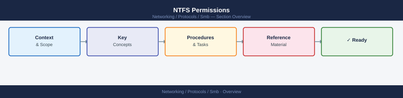

---
tags:
  - networking
---
# NTFS Permissions


<div class="kb-summary">
NTFS Permissions reference covering Overview, NTFS Permission Types, icacls Reference, Inheritance, Effective Permissions and 1 more sections.
</div>



## Overview

NTFS permissions control access to files and folders at the filesystem level on Windows volumes. They are distinct from share permissions and apply whether access comes over the network or locally. Effective access is determined by combining both layers: the most restrictive result of NTFS and share permissions wins.

| Layer | Scope | Tool |
|---|---|---|
| Share permissions | Network access only | `net share`, Server Manager |
| NTFS permissions | Local and network | `icacls`, `Get-Acl` |
| Effective permissions | Combined result | Security tab → Advanced |

## NTFS Permission Types

Standard NTFS permissions are composed from these basic rights:

- **Full Control** — read, write, execute, delete, change permissions, take ownership
- **Modify** — read, write, execute, delete; cannot change permissions
- **Read & Execute** — list folder contents, open files, run executables
- **List Folder Contents** — folder-level only; list directory entries
- **Read** — view file content and attributes
- **Write** — create files and folders, write data, modify attributes

```powershell
# View NTFS permissions on a folder
Get-Acl -Path "C:\Shares\Finance" | Format-List

# View ACL entries individually
(Get-Acl -Path "C:\Shares\Finance").Access | Select-Object IdentityReference, FileSystemRights, AccessControlType, IsInherited
```

## icacls Reference

`icacls` is the primary command-line tool for viewing and modifying NTFS ACLs.

```bash
# Display permissions for a folder and its contents
icacls "C:\Shares\Finance"

# Grant a user Modify rights (not inherited)
icacls "C:\Shares\Finance" /grant "DOMAIN\jsmith:(OI)(CI)M"

# Remove all explicit permissions for a user
icacls "C:\Shares\Finance" /remove "DOMAIN\jsmith"

# Reset permissions to inherited only (removes all explicit entries)
icacls "C:\Shares\Finance" /reset /T /C

# Copy permissions from one path to another
icacls "C:\Shares\Finance" /save ntfs_acl.txt
icacls "C:\Shares\NewFinance" /restore ntfs_acl.txt
```

Inheritance flags: `(OI)` = object inherit, `(CI)` = container inherit, `(NP)` = no propagate, `(IO)` = inherit only.

## Inheritance

By default, child objects inherit permissions from their parent. Inheritance can be blocked at any level.

```powershell
# Disable inheritance and copy existing inherited entries as explicit
$acl = Get-Acl "C:\Shares\Finance\Confidential"
$acl.SetAccessRuleProtection($true, $true)   # block inheritance, copy existing
Set-Acl -Path "C:\Shares\Finance\Confidential" -AclObject $acl

# Re-enable inheritance (removes explicit entries that duplicated inherited ones)
$acl.SetAccessRuleProtection($false, $false)
Set-Acl -Path "C:\Shares\Finance\Confidential" -AclObject $acl
```

Check inheritance state in the output of `icacls`: entries marked `(I)` are inherited; entries without `(I)` are explicit.

## Effective Permissions

Effective permissions are the union of all allow rules minus any deny rules across all group memberships. Use the Security tab or PowerShell to evaluate.

```powershell
# Get effective access for a specific user (Windows Server 2012+)
$path = "C:\Shares\Finance"
$user = "DOMAIN\jsmith"
$acl  = Get-Acl -Path $path
$acl.Access | Where-Object { $_.IdentityReference -like "*jsmith*" } |
    Select-Object FileSystemRights, AccessControlType, IsInherited

# Use .NET to compute effective rights (requires group membership resolution)
[System.Security.AccessControl.FileSecurity]
```

In Server Manager or File Explorer: Properties → Security → Advanced → Effective Access → select user.

## Ownership and Auditing

```powershell
# Check current owner
(Get-Acl "C:\Shares\Finance").Owner

# Take ownership (requires SeRestorePrivilege or local admin)
icacls "C:\Shares\Finance" /setowner "DOMAIN\admin" /T /C

# Enable auditing on a folder (Success + Failure for all users)
$audit = New-Object System.Security.AccessControl.FileSystemAuditRule(
    "Everyone", "FullControl", "ContainerInherit,ObjectInherit", "None", "Success,Failure"
)
$acl = Get-Acl "C:\Shares\Finance"
$acl.AddAuditRule($audit)
Set-Acl -Path "C:\Shares\Finance" -AclObject $acl
```

Audit events appear in the Security event log under Event ID 4663 (object access).
