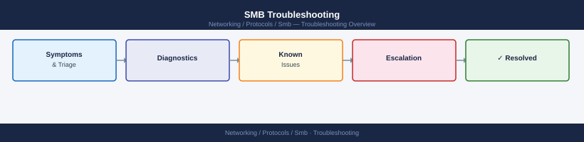

---
tags:
  - networking
  - troubleshooting
search:
  boost: 1.5
---
# SMB Troubleshooting


<div class="kb-summary">
SMB Troubleshooting reference covering Overview, Access Denied Diagnostics, SMB1 Disabled Issues, Kerberos vs NTLM Authentication, Signing Mismatch and 1 more sections.
</div>



```d2
direction: down

symptom: Identify Symptom {shape: diamond}
access_denied_diagnostics: "Access Denied Diagnostics" {shape: rectangle}
smb1_disabled_issues: "SMB1 Disabled Issues" {shape: rectangle}
kerberos_vs_ntlm_authentication: "Kerberos vs NTLM Authentication" {shape: rectangle}
signing_mismatch: "Signing Mismatch" {shape: rectangle}
performance_and_connectivity_tests: "Performance and Connectivity Tests" {shape: rectangle}
verify_resolution: "Verify resolution" {shape: rectangle}
resolution: Resolve or Escalate {shape: oval}

symptom -> access_denied_diagnostics: investigate
symptom -> smb1_disabled_issues: investigate
symptom -> kerberos_vs_ntlm_authentication: investigate
symptom -> signing_mismatch: investigate
symptom -> performance_and_connectivity_tests: investigate
symptom -> verify_resolution: investigate
access_denied_diagnostics -> resolution
smb1_disabled_issues -> resolution
kerberos_vs_ntlm_authentication -> resolution
signing_mismatch -> resolution
performance_and_connectivity_tests -> resolution
verify_resolution -> resolution
```

## Before you begin

- **Access:** Network admin credentials; console or SSH to devices
- **Gather first:** recent error message text, event timestamps, and affected object names
- **Scope:** confirm whether the issue affects a single object, host, cluster, or site
- **Escalation:** open a vendor support ticket before running any destructive step
- **Logging:** document each command and output — required if escalation is needed

---

## Overview

SMB access problems fall into a small set of categories: permission denials, authentication failures (Kerberos vs NTLM), performance issues, version mismatches, and signing conflicts. Start by narrowing which layer is failing before diving into logs.

| Symptom | Likely Cause | First Check |
|---|---|---|
| Access denied | NTFS or share permission | `icacls`, `Get-SmbShareAccess` |
| Slow file transfers | SMB1 negotiated, offload disabled | `Get-SmbSession` dialect |
| Cannot connect at all | SMB disabled, firewall | `Test-NetConnection -Port 445` |
| Signing mismatch | Require vs Enable conflict | `Get-SmbServerConfiguration` |
| Kerberos fallback to NTLM | DNS resolution, SPN missing | `klist`, `setspn` |

## Access Denied Diagnostics

```powershell
# Verify share permissions
Get-SmbShareAccess -Name "Finance"

# Verify NTFS permissions on the path
icacls "C:\Shares\Finance"

# Check effective NTFS rights for a specific user
(Get-Acl "C:\Shares\Finance").Access |
    Where-Object { $_.IdentityReference -match "jsmith" } |
    Select-Object FileSystemRights, AccessControlType, IsInherited

# Check Event ID 5145 (share access check) in Security log
Get-WinEvent -FilterHashtable @{LogName='Security'; Id=5145} -MaxEvents 20 |
    Select-Object TimeCreated, Message
```

## SMB1 Disabled Issues

SMB1 is disabled by default on Windows Server 2016+ and Windows 10 1709+. Legacy devices (NAS, printers, old workstations) may still require it.

```powershell
# Check SMB1 status
Get-SmbServerConfiguration | Select-Object EnableSMB1Protocol

# Check if SMB1 feature is installed
Get-WindowsOptionalFeature -Online -FeatureName SMB1Protocol

# Enable SMB1 temporarily for legacy device (then disable after migration)
Enable-WindowsOptionalFeature -Online -FeatureName SMB1Protocol -NoRestart

# Disable SMB1
Disable-WindowsOptionalFeature -Online -FeatureName SMB1Protocol -NoRestart
```

## Kerberos vs NTLM Authentication

```bash
# Check Kerberos tickets on the client
klist

# Purge Kerberos cache and force re-authentication
klist purge

# Check SPN for file server (required for Kerberos to work)
setspn -Q host/fileserver01
setspn -Q host/fileserver01.corp.example.com

# Register missing SPN
setspn -A cifs/fileserver01 DOMAIN\fileserver01$
setspn -A cifs/fileserver01.corp.example.com DOMAIN\fileserver01$
```

## Signing Mismatch

```powershell
# Server requires signing; client does not support it — or vice versa
# Check server
Get-SmbServerConfiguration | Select-Object RequireSecuritySignature, EnableSecuritySignature

# Check client
Get-SmbClientConfiguration | Select-Object RequireSecuritySignature, EnableSecuritySignature

# Fix: align both sides (either both require, or server enables/does not require)
Set-SmbServerConfiguration -EnableSecuritySignature $true -RequireSecuritySignature $false -Force
Set-SmbClientConfiguration -EnableSecuritySignature $true -RequireSecuritySignature $false -Force
```

## Performance and Connectivity Tests

```powershell
# Test SMB port connectivity from client to server
Test-NetConnection -ComputerName fileserver01 -Port 445

# Check negotiated SMB dialect on active sessions
Get-SmbSession | Select-Object ClientComputerName, Dialect, NumOpens

# Run SMB bandwidth test (requires SmbBandwidthLimit module or robocopy timing)
Measure-Command {
    Copy-Item -Path "\\fileserver01\Finance\testfile.dat" -Destination "C:\Temp\" -Force
}

# Enable SMB tracing for deep diagnostics
netsh trace start capture=yes provider="Microsoft-Windows-SMBClient" level=4
# Reproduce the issue, then stop:
netsh trace stop
```

---

## Verify resolution

- Confirm the original symptom no longer occurs
- Check logs for any residual errors related to the issue
- Monitor for 10–15 minutes to confirm the fix is stable

## See also

- [Ntfs](../ntfs/)
- [Permissions](../permissions/)
- [Sessions](../sessions/)
- [Shares](../shares/)
- [SMB — Overview](../)
