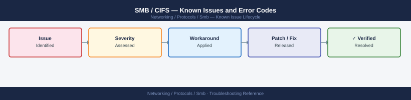

---
tags:
  - troubleshooting
  - smb
  - networking
  - known-issues
---
# SMB / CIFS — Known Issues and Error Codes

Catalog of known SMB issues covering access denied, share enumeration, signing, and SMB version compatibility.

*Applies to: SMB 2.x / 3.x — Windows / Linux / NAS*

## Before you begin

- Windows SMB errors appear in Event Viewer → System (event IDs 30801–30812 for SMB client).
- Linux: `smbclient -L //<server> -U user` to list shares; `mount -t cifs //server/share /mnt -o user=...` to test mount.
- Most SMB issues are authentication (Kerberos/NTLM), signing mismatch, or firewall (port 445).

## Access Denied

| Error / Symptom | Cause | Workaround / Fix |
|---|---|---|
| `Error 5: Access is denied` | Incorrect permissions on share or NTFS ACL | Verify share permissions AND NTFS permissions; both must allow access |
| `Logon failure: unknown user name or bad password` | Wrong credentials; or account locked | Verify credentials; check account lockout in AD |
| Kerberos error accessing share | SPN not registered for server FQDN | Register SPN: `setspn -A cifs/<server-fqdn> <computer-account>` |

## Connectivity

| Error / Symptom | Cause | Workaround / Fix |
|---|---|---|
| `\\server\share is not accessible — network path not found` | TCP 445 blocked; or DNS not resolving server name | Verify TCP 445 from client to server; verify DNS resolution of server name |
| SMB connection works on LAN but not over VPN | VPN not passing SMB traffic; or MTU issue | Verify TCP 445 over VPN; check VPN MTU (1350 or lower may be needed) |

## SMB Version and Signing

| Error / Symptom | Cause | Workaround / Fix |
|---|---|---|
| `The server does not support the requested protocol` | SMB version mismatch; SMB1 disabled | Enable SMB2/3 on legacy server; do not re-enable SMB1 | N/A |
| Slow SMB transfer speeds | SMB signing enabled unnecessarily for all connections | Disable signing requirement if security policy permits: `Set-SmbServerConfiguration -RequireSecuritySignature $false` |

## See also

