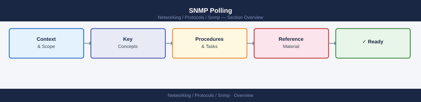

---
tags:
  - networking
---
# SNMP Polling


<div class="kb-summary">
SNMP polling is the process of an NMS periodically querying devices to collect metrics.
</div>



Unlike traps, polling is initiated by the manager on a schedule.

## Poll Operations

| Operation | Version | Description |
|---|---|---|
| `GET` | v1, v2c, v3 | Retrieve a single OID value |
| `GETNEXT` | v1, v2c, v3 | Retrieve next OID in MIB tree |
| `GETBULK` | v2c, v3 | Retrieve multiple OIDs in one request (efficient for tables) |
| `SET` | v1, v2c, v3 | Write a value to a device (requires RW community) |

## Common CLI Polling Commands

```bash
# Single OID — system description
snmpget -v2c -c <community> <device-ip> sysDescr.0

# Walk a MIB subtree
snmpwalk -v2c -c <community> <device-ip> system
snmpwalk -v2c -c <community> <device-ip> interfaces
snmpwalk -v2c -c <community> <device-ip> ifTable

# Bulk walk (faster for large MIBs)
snmpbulkwalk -v2c -c <community> -Cn0 -Cr25 <device-ip> ifTable

# Translate OID to human-readable name
snmptranslate -On .1.3.6.1.2.1.1.1.0        # numeric → name
snmptranslate .1.3.6.1.2.1.1.1.0            # OID info
snmptranslate -Td sysDescr                  # detailed MIB info
```

## Common OIDs for Polling

| OID | Name | Metric |
|---|---|---|
| `1.3.6.1.2.1.1.1.0` | sysDescr | Device description |
| `1.3.6.1.2.1.1.3.0` | sysUpTime | Uptime (hundredths of a second) |
| `1.3.6.1.2.1.1.5.0` | sysName | Device hostname |
| `1.3.6.1.2.1.2.1.0` | ifNumber | Number of interfaces |
| `1.3.6.1.2.1.2.2.1.10` | ifInOctets | Interface inbound bytes (counter) |
| `1.3.6.1.2.1.2.2.1.16` | ifOutOctets | Interface outbound bytes (counter) |
| `1.3.6.1.2.1.2.2.1.8` | ifOperStatus | Interface operational status (1=up, 2=down) |
| `1.3.6.1.4.1.9.9.109.1.1.1.1.3` | Cisco CPU utilisation | CPU % (Cisco) |
| `1.3.6.1.4.1.2021.10.1.3.1` | UCD-SNMP 1-min load | CPU load (Linux) |
| `1.3.6.1.4.1.2021.4.6.0` | memAvailReal | Available memory (Linux) |

## Polling Intervals

| Data type | Recommended interval | Why |
|---|---|---|
| Interface counters | 60–300s | Counters roll fast on 10/100G links |
| CPU/memory | 60–120s | Trend useful; sub-minute polling creates load |
| Interface status (up/down) | 30–60s | Quick detection of link events |
| Environmental (temp, PSU) | 300s | Changes slowly |
| Uptime | 300–600s | Only for reboot detection |

## Zabbix SNMP Polling Config

```yaml
# Zabbix item config (SNMP interface)
Type: SNMP agent
Key: ifOperStatus[{#SNMPINDEX}]
SNMP OID: .1.3.6.1.2.1.2.2.1.8.{#SNMPINDEX}
Update interval: 60s
```

## Prometheus + SNMP Exporter

```yaml
# snmp_exporter/snmp.yml — generator config snippet
modules:
  cisco_ios:
    walk:
      - 1.3.6.1.2.1.2.2          # interfaces
      - 1.3.6.1.2.1.31.1.1       # ifXTable
    metrics:
      - name: ifOperStatus
        oid:  1.3.6.1.2.1.2.2.1.8
        type: gauge

# prometheus.yml scrape config
scrape_configs:
  - job_name: snmp
    static_configs:
      - targets: [<device-ip>]
    metrics_path: /snmp
    params:
      module: [cisco_ios]
    relabel_configs:
      - source_labels: [__address__]
        target_label: __param_target
      - target_label: __address__
        replacement: <snmp-exporter-host>:9116
```

## Common Issues

| Symptom | Cause | Check |
|---|---|---|
| `Timeout: No Response` | Community wrong or UDP 161 blocked | `snmpget` manually; `tcpdump` on device |
| Counter resets | Interface or device reboot | Normal — NMS should handle counter wraps |
| Slow poll / timeouts | Device CPU overloaded by SNMP | Increase poll interval; use GETBULK |
| OID not found | MIB not supported by device | Check with `snmpwalk`; use vendor MIB file |
