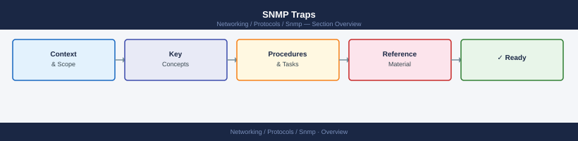

---
tags:
  - networking
---
# SNMP Traps


<div class="kb-summary">
SNMP traps are unsolicited notifications sent from a device to a trap receiver (NMS) when an event occurs
</div>



        TRAP FLOW (device-initiated, async)

— a link going down, a threshold being crossed, or a hardware fault. Unlike polling, traps push alerts in real time.

## Trap vs Inform

| Type | Acknowledgement | Reliability | Version |
|---|---|---|---|
| **Trap** | None | Fire-and-forget | v1, v2c, v3 |
| **Inform** | Manager sends ACK | Reliable delivery | v2c, v3 |

Use Informs where delivery confirmation matters (e.g. critical hardware alarms).

## Configuring Trap Destinations

### Linux (snmpd)

```bash
# /etc/snmp/snmpd.conf

# SNMPv2c trap destination
trapsink    <nms-ip>  <community>  162

# SNMPv2c inform destination
trap2sink   <nms-ip>  <community>  162

# SNMPv3 trap
trapsess -v 3 -u trapuser -l authPriv -a SHA -A <authpass> -x AES -X <privpass> <nms-ip>

systemctl restart snmpd
```

### Cisco IOS

```bash
snmp-server enable traps
snmp-server host <nms-ip> version 2c <community>

# Specific trap types
snmp-server enable traps snmp linkdown linkup
snmp-server enable traps envmon
snmp-server enable traps bgp

# Verify
show snmp host
show snmp trap
```

### Arista EOS

```text
snmp-server host <nms-ip> version 2c <community>
snmp-server enable traps
show snmp host
```

### Brocade FOS

```bash
snmpconfig --set mibCapability
# Enable trap categories via prompts

snmpconfig --set snmpv1
# Set trap recipient IP and community

snmpconfig --show mibCapability
```

## Testing Trap Delivery

```bash
# Send a test trap from Linux to NMS
snmptrap -v2c -c <community> <nms-ip> '' \
  1.3.6.1.6.3.1.1.5.3 \
  1.3.6.1.2.1.2.2.1.1.1 i 1

# Or use snmptrapd to listen and verify locally
snmptrapd -f -Lo -c /etc/snmp/snmptrapd.conf

# Check NMS received the trap
# → Zabbix: Monitoring → Latest Data → filter by host
# → Prometheus: check alertmanager log for SNMP trap receiver
```

## Common Trap OIDs

| Trap | OID |
|---|---|
| Link Down | 1.3.6.1.6.3.1.1.5.3 |
| Link Up | 1.3.6.1.6.3.1.1.5.4 |
| Cold Start | 1.3.6.1.6.3.1.1.5.1 |
| Warm Start | 1.3.6.1.6.3.1.1.5.2 |
| Authentication Failure | 1.3.6.1.6.3.1.1.5.5 |

## Trap Receiver — snmptrapd

```bash
# /etc/snmp/snmptrapd.conf
authCommunity log,execute,net <community>

# Log all traps
logOption f /var/log/snmptrapd.log

# Forward to syslog
traphandle default /usr/sbin/snmptrapd-handler

systemctl enable --now snmptrapd
```

## Common Issues

| Symptom | Cause | Check |
|---|---|---|
| No traps received at NMS | Destination IP/port wrong or UDP 162 blocked | `tcpdump -i any udp port 162` at NMS |
| Traps arrive but NMS ignores | Community mismatch | Verify community on device matches NMS config |
| Trap storm | Device sending traps in a loop | Check device state; apply trap rate limiting |
| Inform not acknowledged | NMS not configured for informs | Check NMS SNMP inform handling |
