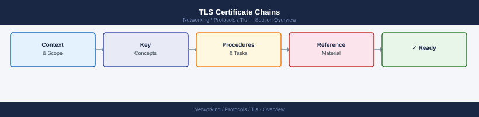

---
tags:
  - networking
---
# TLS Certificate Chains


<div class="kb-summary">
A certificate chain (or chain of trust) links a server certificate back to a trusted root CA through one or more intermediate CAs.
</div>



If the chain is broken or incomplete, clients will reject the certificate.

## Chain Structure

```text
Root CA (self-signed, in OS/browser trust store)
  └── Intermediate CA (signed by Root CA)
        └── Server Certificate (signed by Intermediate CA)
```

The server presents its certificate plus all intermediate certificates. The client verifies each signature up to a trusted root.

## Why Chains Break

- Server configured with certificate only (no intermediate)
- Intermediate CA certificate not included in the bundle
- Wrong intermediate (from a different CA hierarchy)
- Intermediate and server certificate order reversed
- Root CA not in client's trust store (self-signed internal CA)

## Checking the Chain

```bash
# View full chain served by a live endpoint
openssl s_client -connect <hostname>:443 -servername <hostname>

# Output shows: Certificate chain
# 0 s:CN=web.example.com (server cert)
#   i:CN=Example Intermediate CA
# 1 s:CN=Example Intermediate CA
#   i:CN=Example Root CA

# Verify chain file locally
openssl verify -CAfile chain.pem server.crt

# Check chain order in a bundle file
openssl crl2pkcs7 -nocrl -certfile bundle.pem | \
  openssl pkcs7 -print_certs -noout
```

## Building a Chain Bundle

The bundle should be ordered: server cert → intermediate(s) → (optionally root).

```bash
# Concatenate into bundle
cat server.crt intermediate.crt > bundle.pem

# Optional: include root (some applications require it)
cat server.crt intermediate.crt root.crt > full-chain.pem

# Verify the bundle
openssl verify -CAfile root.crt -untrusted intermediate.crt server.crt
```

## Configuring Chain in Common Web Servers

### nginx

```nginx
# nginx — combine cert and intermediates into one file
ssl_certificate     /etc/ssl/server-chain.pem;   # cert + intermediates
ssl_certificate_key /etc/ssl/server.key;

# Build the chain file:
# cat server.crt intermediate.crt > /etc/ssl/server-chain.pem
```

### Apache httpd

```apache
SSLCertificateFile    /etc/ssl/server.crt
SSLCertificateKeyFile /etc/ssl/server.key
SSLCACertificateFile  /etc/ssl/intermediate.crt  # or chain bundle
```

### HAProxy

```bash
# HAProxy expects cert + key + chain in one PEM file
cat server.crt intermediate.crt server.key > /etc/ssl/haproxy.pem
```

## Installing Internal CA Certificates

To make an internal CA trusted by Linux hosts:

```bash
# RHEL/Rocky
cp internal-ca.crt /etc/pki/ca-trust/source/anchors/
update-ca-trust

# Ubuntu/Debian
cp internal-ca.crt /usr/local/share/ca-certificates/
update-ca-certificates

# Verify
openssl verify -CAfile /etc/ssl/certs/ca-certificates.crt server.crt
```

## Online Chain Verification Tools

```bash
# SSL Labs (external)
# https://www.ssllabs.com/ssltest/

# Check chain via openssl — simulates client verification
openssl s_client -connect <hostname>:443 -servername <hostname> -verify_return_error

# Verify with specific CA bundle
curl --cacert /path/to/ca-bundle.pem https://<hostname>/
```

## Common Issues

| Symptom | Cause | Fix |
|---|---|---|
| `unable to get local issuer certificate` | Intermediate missing | Add intermediate CA to bundle |
| `certificate verify failed` | Internal CA not trusted | Install internal CA cert on client |
| `self signed certificate in certificate chain` | Root in chain but not in trust store | Install root CA or remove from chain |
| Chain shows only depth 0 | Server not sending intermediate | Configure server to send full chain |
| Chain correct in browser, fails in app | App uses its own trust store (Java) | Import CA into Java keystore: `keytool -import` |
