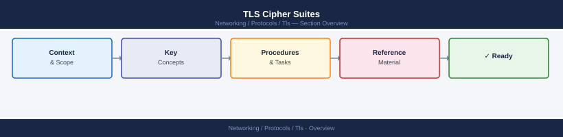

---
tags:
  - networking
---
# TLS Cipher Suites


<div class="kb-summary">
A cipher suite specifies the algorithms used for key exchange, authentication, encryption, and integrity in a TLS connection. Weak cipher suites allow downgrade attacks or data exposure.
</div>



## Cipher Suite Name Structure (TLS 1.2)

```text
TLS_ECDHE_RSA_WITH_AES_256_GCM_SHA384
│   │         │   │        │                                                                            │
│   │         │   │        │   MAC (integrity)
│   │         │   │        mode
│   │         │   key size
│   │         bulk cipher (symmetric encryption)
│   key exchange + auth
TLS protocol prefix
```

TLS 1.3 simplifies this — cipher suites only specify the symmetric cipher and hash:
```text
TLS_AES_256_GCM_SHA384
TLS_CHACHA20_POLY1305_SHA256
```

## Recommended Cipher Suites

### TLS 1.3 (preferred — no choice needed, all are secure)

```text
TLS_AES_256_GCM_SHA384
TLS_AES_128_GCM_SHA256
TLS_CHACHA20_POLY1305_SHA256
```

### TLS 1.2 — Allowed

```text
TLS_ECDHE_RSA_WITH_AES_256_GCM_SHA384
TLS_ECDHE_RSA_WITH_AES_128_GCM_SHA256
TLS_ECDHE_ECDSA_WITH_AES_256_GCM_SHA384
TLS_ECDHE_ECDSA_WITH_AES_128_GCM_SHA256
```

Key requirements: ECDHE (forward secrecy), GCM (authenticated encryption), SHA-256+.

### TLS 1.2 — Deprecated / Avoid

| Cipher element | Why to avoid |
|---|---|
| RSA key exchange (no ECDHE) | No forward secrecy |
| DH < 2048 bits | Logjam attack |
| RC4 | Statistically broken |
| 3DES | SWEET32 birthday attack |
| CBC mode (in TLS 1.2) | Lucky-13, BEAST — acceptable with mitigations, prefer GCM |
| MD5, SHA-1 MAC | Weak integrity |

## Checking Ciphers on a Live Endpoint

```bash
# Show TLS version and cipher negotiated
openssl s_client -connect <hostname>:443 -servername <hostname> 2>/dev/null \
  | grep -E "Protocol|Cipher"

# Enumerate all accepted ciphers (nmap)
nmap --script ssl-enum-ciphers -p 443 <hostname>

# testssl.sh — comprehensive cipher and vulnerability scan
./testssl.sh <hostname>:443
```

## Configuring Ciphers

### nginx

```nginx
ssl_protocols TLSv1.2 TLSv1.3;
ssl_ciphers 'ECDHE-ECDSA-AES256-GCM-SHA384:ECDHE-RSA-AES256-GCM-SHA384:ECDHE-ECDSA-AES128-GCM-SHA256:ECDHE-RSA-AES128-GCM-SHA256:!aNULL:!eNULL:!EXPORT:!RC4:!3DES:!MD5';
ssl_prefer_server_ciphers on;
```

### Apache httpd

```apache
SSLProtocol all -SSLv3 -TLSv1 -TLSv1.1
SSLCipherSuite ECDHE-ECDSA-AES256-GCM-SHA384:ECDHE-RSA-AES256-GCM-SHA384:!aNULL:!RC4:!3DES
SSLHonorCipherOrder on
```

### HAProxy

```text
bind *:443 ssl crt /etc/ssl/haproxy.pem \
  ciphers ECDHE-ECDSA-AES256-GCM-SHA384:ECDHE-RSA-AES256-GCM-SHA384 \
  no-sslv3 no-tlsv10 no-tlsv11
```

### OpenSSL — System-Wide Policy (RHEL/Rocky)

```bash
# Set system-wide crypto policy
update-crypto-policies --set DEFAULT     # balanced
update-crypto-policies --set FUTURE      # strict — TLS 1.3 only
update-crypto-policies --set LEGACY      # allows TLS 1.0 (avoid)

update-crypto-policies --show
```

## TLS Version Standards

| Version | Status | Action |
|---|---|---|
| SSL 3.0 | Broken (POODLE) | Disable immediately |
| TLS 1.0 | Deprecated | Disable — fails PCI DSS |
| TLS 1.1 | Deprecated | Disable |
| TLS 1.2 | Acceptable | Allow with strong ciphers only |
| TLS 1.3 | Preferred | Enable; enforce where possible |

## Common Issues

| Symptom | Cause | Check |
|---|---|---|
| Client can't connect | No cipher overlap between client and server | `openssl s_client` — compare cipher lists |
| Old devices can't connect | Server too restrictive | Add limited TLS 1.2 ciphers for legacy support |
| BEAST/POODLE alerts | Old cipher/protocol enabled | Disable CBC ciphers and TLS < 1.2 |
| `handshake failure` | Mutual TLS mismatch or no common cipher | Run `nmap --script ssl-enum-ciphers` |
