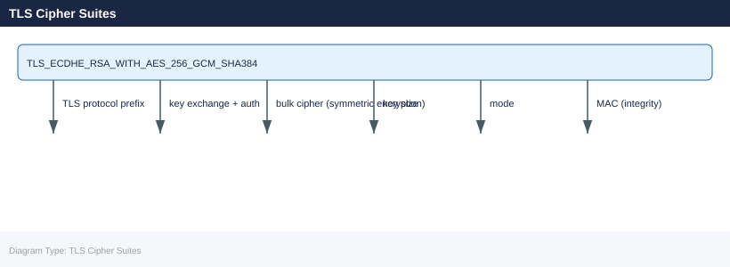

---
tags:
  - networking
description: "A cipher suite specifies the algorithms used for key exchange, authentication, encryption, and integrity in a TLS connection. Weak cipher suites allow..."
---
# TLS Cipher Suites

<div class="kb-summary">
A cipher suite specifies the algorithms used for key exchange, authentication, encryption, and integrity in a TLS connection. Weak cipher suites allow downgrade attacks or data exposure.
</div>

## Cipher Suite Name Structure (TLS 1.2)



TLS 1.3 simplifies this — cipher suites only specify the symmetric cipher and hash:
```text
TLS_AES_256_GCM_SHA384
TLS_CHACHA20_POLY1305_SHA256
```

## Recommended Cipher Suites

### TLS 1.3 (preferred — no choice needed, all are secure)

```text
TLS_AES_256_GCM_SHA384
TLS_AES_128_GCM_SHA256
TLS_CHACHA20_POLY1305_SHA256
```

### TLS 1.2 — Allowed

```text
TLS_ECDHE_RSA_WITH_AES_256_GCM_SHA384
TLS_ECDHE_RSA_WITH_AES_128_GCM_SHA256
TLS_ECDHE_ECDSA_WITH_AES_256_GCM_SHA384
TLS_ECDHE_ECDSA_WITH_AES_128_GCM_SHA256
```

Key requirements: ECDHE (forward secrecy), GCM (authenticated encryption), SHA-256+.

### TLS 1.2 — Deprecated / Avoid

| Cipher element | Why to avoid |
|---|---|
| RSA key exchange (no ECDHE) | No forward secrecy |
| DH < 2048 bits | Logjam attack |
| RC4 | Statistically broken |
| 3DES | SWEET32 birthday attack |
| CBC mode (in TLS 1.2) | Lucky-13, BEAST — acceptable with mitigations, prefer GCM |
| MD5, SHA-1 MAC | Weak integrity |

## Checking Ciphers on a Live Endpoint

```bash
# Show TLS version and cipher negotiated
openssl s_client -connect <hostname>:443 -servername <hostname> 2>/dev/null \
  | grep -E "Protocol|Cipher"

# Enumerate all accepted ciphers (nmap)
nmap --script ssl-enum-ciphers -p 443 <hostname>

# testssl.sh — comprehensive cipher and vulnerability scan
./testssl.sh <hostname>:443
```


```text title="Expected output"
Protocol  : TLSv1.2
Cipher    : ECDHE-RSA-AES256-GCM-SHA384

Starting Nmap 7.92 ( https://nmap.org ) at 2024-01-15 10:42 UTC
Nmap scan report for api.example.com (203.0.113.42)
Host is up (0.048s latency).

PORT    STATE SERVICE
443/tcp open  https
| ssl-enum-ciphers:
|   TLSv1.2:
|     strong ciphers:
|       ECDHE-RSA-AES256-GCM-SHA384 (256 bits) - A
|       ECDHE-RSA-AES128-GCM-SHA256 (128 bits) - A
|     weak ciphers:
|       DES-CBC3-SHA (168 bits) - D
|_  least strength: D

###################################################################
testssl.sh 3.0.7 from https://github.com/drwetter/testssl.sh
api.example.com:443
###################################################################
Testing protocols via sockets except NPN+ALPN
TLSv1.2     supported
TLSv1.3     supported
Testing cipher categories
Null Cipher           not offered
Weak Ciphers          offered (DES-CBC3-SHA)
Strong Ciphers        offered
```

!!! warning "Common errors"
    **`nmap: command not found`** — Install nmap with `apt-get install nmap` (Debian/Ubuntu) or `brew install nmap` (macOS).
    **`./testssl.sh: Permission denied`** — Make the script executable with `chmod +x testssl.sh`.
    **`SSL_ERROR_RX_RECORD_TOO_LONG`** — Verify the hostname and port are correct; this error often indicates a non-HTTPS service on port 443.
## Configuring Ciphers

### nginx

```nginx
ssl_protocols TLSv1.2 TLSv1.3;
ssl_ciphers 'ECDHE-ECDSA-AES256-GCM-SHA384:ECDHE-RSA-AES256-GCM-SHA384:ECDHE-ECDSA-AES128-GCM-SHA256:ECDHE-RSA-AES128-GCM-SHA256:!aNULL:!eNULL:!EXPORT:!RC4:!3DES:!MD5';
ssl_prefer_server_ciphers on;
```

### Apache httpd

```apache
SSLProtocol all -SSLv3 -TLSv1 -TLSv1.1
SSLCipherSuite ECDHE-ECDSA-AES256-GCM-SHA384:ECDHE-RSA-AES256-GCM-SHA384:!aNULL:!RC4:!3DES
SSLHonorCipherOrder on
```

### HAProxy

```text
bind *:443 ssl crt /etc/ssl/haproxy.pem \
  ciphers ECDHE-ECDSA-AES256-GCM-SHA384:ECDHE-RSA-AES256-GCM-SHA384 \
  no-sslv3 no-tlsv10 no-tlsv11
```

### OpenSSL — System-Wide Policy (RHEL/Rocky)

```bash
# Set system-wide crypto policy
update-crypto-policies --set DEFAULT     # balanced
update-crypto-policies --set FUTURE      # strict — TLS 1.3 only
update-crypto-policies --set LEGACY      # allows TLS 1.0 (avoid)

update-crypto-policies --show
```


```text title="Expected output"
Setting crypto policy to DEFAULT
Crypto policy set to DEFAULT
Setting crypto policy to FUTURE
Crypto policy set to FUTURE
Setting crypto policy to LEGACY
Crypto policy set to LEGACY
LEGACY
```

!!! warning "Common errors"
    **`update-crypto-policies: command not found`** — Install the crypto-policies package with `sudo apt-get install crypto-policies` (Debian/Ubuntu) or `sudo dnf install crypto-policies` (RHEL/Fedora).
    **`Error: invalid policy name 'DEFAULT'`** — Use uppercase policy names only; valid options are DEFAULT, FUTURE, LEGACY, FIPS, or FIPS-NG.
    **`Error: cannot write to /etc/crypto-policies/state/current`** — Run the command with `sudo` to obtain root privileges required for system-wide policy changes.
## TLS Version Standards

| Version | Status | Action |
|---|---|---|
| SSL 3.0 | Broken (POODLE) | Disable immediately |
| TLS 1.0 | Deprecated | Disable — fails PCI DSS |
| TLS 1.1 | Deprecated | Disable |
| TLS 1.2 | Acceptable | Allow with strong ciphers only |
| TLS 1.3 | Preferred | Enable; enforce where possible |

## Common Issues

| Symptom | Cause | Check |
|---|---|---|
| Client can't connect | No cipher overlap between client and server | `openssl s_client` — compare cipher lists |
| Old devices can't connect | Server too restrictive | Add limited TLS 1.2 ciphers for legacy support |
| BEAST/POODLE alerts | Old cipher/protocol enabled | Disable CBC ciphers and TLS < 1.2 |
| `handshake failure` | Mutual TLS mismatch or no common cipher | Run `nmap --script ssl-enum-ciphers` |
