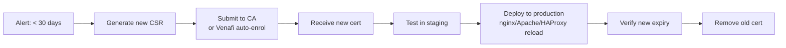

# TLS Certificate Expiration


<div class="kb-summary">
Expired certificates cause immediate outages — services reject connections without warning.
</div>

```text
┌───────────────────────────────────────────────────────────────────────────────────────────────────────┐
│  Days remaining    Alert level     Action                                                             │
│  ─────────────     ───────────     ──────                                                             │
│  90 days           Info            Begin renewal planning                                             │
│  │                                                                                                    │
│  30 days           Warning ───────► Initiate renewal now                                              │
│  │                                                                                                    │
│  14 days           Warning ───────► Renewal must be active                                            │
│  │                                                                                                    │
│  7 days            Critical ──────► Immediate action req'd                                            │
│  │                                                                                                    │
│  0 days            EXPIRED ───────► Service outage                                                    │
│                                                                                                       │
│  Monitoring:                                                                                          │
│  ┌──────────────────────────────────────────────────────┐                                             │
│  │ Prometheus blackbox_exporter                         │                                             │
│  │ probe_ssl_earliest_cert_expiry - time() < 30*86400   │                                             │
│  │ → fires CertExpiryWarning alert                      │                                             │
│  └──────────────────────────────────────────────────────┘                                             │
└───────────────────────────────────────────────────────────────────────────────────────────────────────┘
```
Expiration monitoring and automated renewal must be in place for every certificate in production.

## Checking Expiry

```bash
# Single file
openssl x509 -in certificate.pem -noout -enddate

# Remote endpoint — days until expiry
openssl s_client -connect <hostname>:443 -servername <hostname> </dev/null 2>/dev/null \
  | openssl x509 -noout -enddate

# Days remaining (single line)
echo | openssl s_client -connect <hostname>:443 -servername <hostname> 2>/dev/null \
  | openssl x509 -noout -dates \
  | awk -F= '/notAfter/{print $2}' \
  | xargs -I{} date -d "{}" +%s \
  | xargs -I{} bash -c 'echo $(( ({} - $(date +%s)) / 86400 )) days remaining'

# Bulk check across multiple hosts
for host in web01 web02 api01; do
  expiry=$(echo | openssl s_client -connect ${host}.example.com:443 2>/dev/null \
    | openssl x509 -noout -enddate 2>/dev/null | cut -d= -f2)
  echo "$host: $expiry"
done
```

## Expiry Monitoring

### Prometheus — Blackbox Exporter

```yaml
# prometheus.yml
scrape_configs:
  - job_name: tls_expiry
    metrics_path: /probe
    params:
      module: [tcp_connect]
    static_configs:
      - targets:
          - <hostname>:443
    relabel_configs:
      - source_labels: [__address__]
        target_label: __param_target
      - target_label: __address__
        replacement: localhost:9115

# Alert rule
groups:
  - name: tls
    rules:
      - alert: CertExpiryWarning
        expr: probe_ssl_earliest_cert_expiry - time() < 30 * 86400
        labels:
          severity: warning
        annotations:
          summary: "Certificate on {{ $labels.instance }} expires in < 30 days"

      - alert: CertExpiryCritical
        expr: probe_ssl_earliest_cert_expiry - time() < 7 * 86400
        labels:
          severity: critical
        annotations:
          summary: "Certificate on {{ $labels.instance }} expires in < 7 days"
```

### Nagios / Icinga — check_ssl_cert

```bash
check_ssl_cert -H <hostname> -p 443 -w 30 -c 7
# -w 30: warning at 30 days
# -c 7:  critical at 7 days
```

## Renewal Workflow



### Venafi Automated Renewal

```bash
# Trigger renewal via Venafi CLI
vcert renew --pickup-id <cert-id>

# Or via REST API
curl -s -X POST "https://venafi.example.com/vedsdk/certificates/renew" \
  -H "X-Venafi-API-Key: <key>" \
  -H "Content-Type: application/json" \
  -d '{"CertificateDN":"\\VED\\Policy\\Servers\\web.example.com"}'
```

### Let's Encrypt — certbot

```bash
# Renew all certificates
certbot renew

# Test renewal without committing
certbot renew --dry-run

# Cron job (run twice daily as recommended)
0 0,12 * * * certbot renew --quiet
```

## Emergency Expired Certificate Response

```bash
# 1. Confirm the certificate is expired
openssl s_client -connect <hostname>:443 2>&1 | grep -E "notAfter|verify error"

# 2. Immediate mitigation options:
#    a) Extend using existing CA (if internal)
#    b) Deploy spare/wildcard certificate
#    c) Update DNS to failover endpoint

# 3. Issue replacement certificate (Venafi/ACME/manual CA)

# 4. Deploy without downtime (nginx zero-downtime reload)
nginx -t && nginx -s reload    # tests config before reloading

# 5. Verify new certificate
openssl s_client -connect <hostname>:443 </dev/null 2>/dev/null \
  | openssl x509 -noout -dates
```

## Expiry Thresholds Reference

| Days remaining | Action |
|---|---|
| 90 | Begin renewal planning |
| 30 | Warning alert — initiate renewal |
| 14 | Escalate — renewal must be in progress |
| 7 | Critical — immediate action required |
| 0 | Expired — service impact |
