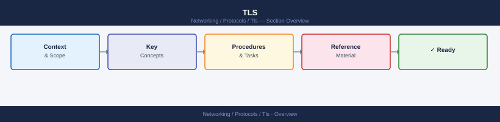

---
tags:
  - networking
---
# TLS

<div class="kb-summary">
TLS reference — certificate chain validation, cipher suites, SNI, mTLS, OCSP/CRL revocation, and common TLS failure diagnosis.
</div>



```xml


<div class="kb-grid kb-grid-1">

<a class="kb-card" href="certificates/">
  <strong>Certificates</strong>
  <span>Certificates notes, checks, commands, and references.</span>
</a>

<a class="kb-card" href="chains/">
  <strong>Chains</strong>
  <span>Chains notes, checks, commands, and references.</span>
</a>

<a class="kb-card" href="expiration/">
  <strong>Expiration</strong>
  <span>Expiration notes, checks, commands, and references.</span>
</a>

<a class="kb-card" href="validation/"><strong>Validation</strong><span>Certificate chain validation, handshake verification, and openssl testing.</span></a>
<a class="kb-card" href="ciphers/"><strong>Cipher Suites</strong><span>TLS 1.2/1.3 cipher suite reference, weak cipher identification, and remediation.</span></a>
<a class="kb-card" href="troubleshooting/"><strong>Troubleshooting</strong><span>TLS handshake failures, certificate errors, and SNI troubleshooting.</span></a>

</div>

```d2
direction: right

center: "TLS" {shape: hexagon}
protocol_versions: "Protocol Versions" {shape: rectangle}
certificate_and_handshake_inspection: "Certificate and Handshake Inspection" {shape: rectangle}
check_certificate_details_for_a_live: "Check certificate details for a live service" {shape: rectangle}
check_expiry_only: "Check expiry only" {shape: rectangle}
show_full_tls_handshake_negotiated_v: "Show full TLS handshake (negotiated version + cipher)" {shape: rectangle}
force_specific_tls_version_testing: "Force specific TLS version (testing)" {shape: rectangle}

center -> protocol_versions
center -> certificate_and_handshake_inspection
center -> check_certificate_details_for_a_live
center -> check_expiry_only
center -> show_full_tls_handshake_negotiated_v
center -> force_specific_tls_version_testing
```

## Protocol Versions

| Version | Status | Notes |
|---|---|---|
| SSLv3 | Prohibited | POODLE vulnerability — disable everywhere |
| TLS 1.0 | Deprecated | PCI-DSS non-compliant after June 2018 |
| TLS 1.1 | Deprecated | No support in modern browsers |
| TLS 1.2 | Current minimum | Required for most compliance frameworks |
| TLS 1.3 | Preferred | Faster handshake; stronger cipher suites |

## Certificate and Handshake Inspection

```

```bash
## Check certificate details for a live service
echo | openssl s_client -connect <host>:443 -servername <host> 2>/dev/null | \
  openssl x509 -noout -text | grep -E "Subject:|Issuer:|Not Before:|Not After:|Subject Alternative Name" -A1

## Check expiry only
echo | openssl s_client -connect <host>:443 -servername <host> 2>/dev/null | \
  openssl x509 -noout -dates

## Show full TLS handshake (negotiated version + cipher)
openssl s_client -connect <host>:443 -servername <host> 2>&1 | \
  grep -E "Protocol|Cipher|Certificate chain|Verify"

## Force specific TLS version (testing)
openssl s_client -connect <host>:443 -tls1_2
openssl s_client -connect <host>:443 -tls1_3

## Check certificate chain completeness
openssl s_client -connect <host>:443 -showcerts 2>/dev/null | grep -E "^---$|subject=|issuer="
```
```bash
## Install testssl.sh for comprehensive audit
curl -O https://testssl.sh/testssl.sh
chmod +x testssl.sh
./testssl.sh <host>:443

## Quick cipher check with nmap
nmap --script ssl-enum-ciphers -p 443 <host>
```
```nginx
ssl_protocols TLSv1.2 TLSv1.3;
ssl_prefer_server_ciphers on;
ssl_ciphers 'ECDHE-ECDSA-AES256-GCM-SHA384:ECDHE-RSA-AES256-GCM-SHA384:ECDHE-ECDSA-AES128-GCM-SHA256:ECDHE-RSA-AES128-GCM-SHA256';
ssl_session_cache shared:SSL:10m;
ssl_session_timeout 1d;
ssl_session_tickets off;
ssl_stapling on;
ssl_stapling_verify on;

## HSTS (once TLS is confirmed working)
add_header Strict-Transport-Security "max-age=63072000; includeSubDomains; preload" always;
```
```apache
SSLProtocol -all +TLSv1.2 +TLSv1.3
SSLCipherSuite ECDHE-ECDSA-AES256-GCM-SHA384:ECDHE-RSA-AES256-GCM-SHA384
SSLHonorCipherOrder on
SSLSessionTickets off
```
```bash
## Check if OCSP stapling is working
openssl s_client -connect <host>:443 -status -servername <host> 2>/dev/null | \
  grep -A 10 "OCSP response"
```
```bash
## Verify a certificate chain (cert.pem + intermediate.pem + root.pem)
openssl verify -CAfile root.pem -untrusted intermediate.pem cert.pem

## Check OCSP status
openssl ocsp \
  -issuer intermediate.pem \
  -cert cert.pem \
  -url $(openssl x509 -in cert.pem -noout -ocsp_uri) \
  -resp_text 2>/dev/null | grep "Cert Status"
```
