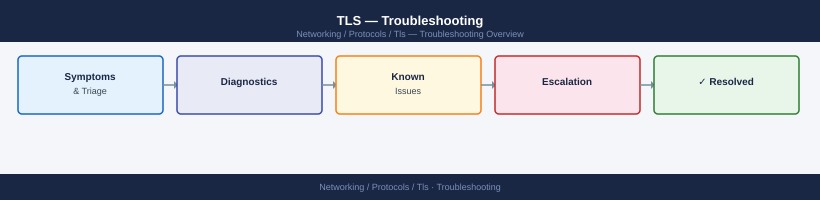

---
tags:
  - networking
  - troubleshooting
search:
  boost: 1.5
---
# TLS — Troubleshooting

<div class="kb-summary">
TLS troubleshooting — certificate chain validation failures, handshake timeouts, cipher negotiation errors, SNI mismatches, and expired certificate diagnosis.
</div>



## Before you begin

- **Access:** Network admin credentials; console or SSH to devices
- **Gather first:** recent error message text, event timestamps, and affected object names
- **Scope:** confirm whether the issue affects a single object, host, cluster, or site
- **Escalation:** open a vendor support ticket before running any destructive step
- **Logging:** document each command and output — required if escalation is needed

---

## Quick Diagnosis

```bash
# Test TLS handshake and show certificate chain
openssl s_client -connect host:443 -servername host.example.com </dev/null 2>&1 | \
  grep -E 'subject|issuer|verify|SSL-Session|Protocol|Cipher'

# Check certificate expiry
echo | openssl s_client -connect host:443 -servername host.example.com 2>/dev/null | \
  openssl x509 -noout -dates

# Check which TLS versions are accepted
for ver in tls1 tls1_1 tls1_2 tls1_3; do
  echo -n "$ver: "
  echo | openssl s_client -connect host:443 -"$ver" 2>&1 | grep -E 'Protocol|connect: Connection refused|alert'
done
```

## Common Errors and Fixes

| Error | Cause | Fix |
|---|---|---|
| `CERTIFICATE_VERIFY_FAILED` | CA not trusted by client | Install CA cert in client trust store |
| `SSL_ERROR_RX_RECORD_TOO_LONG` | Plain HTTP on TLS port | Check if server is returning HTTP not HTTPS |
| `ERR_CERT_DATE_INVALID` | Certificate expired | Renew certificate |
| `ERR_CERT_COMMON_NAME_INVALID` | CN/SAN doesn't match hostname | Check SAN; use `openssl x509 -noout -text` |
| `SSL_ERROR_HANDSHAKE_FAILURE_ALERT` | No cipher in common | Check `ssl_ciphers` config; client may not support TLS 1.3 |
| `ERR_SSL_PROTOCOL_ERROR` | TLS version mismatch | Enable TLS 1.2+ on server; update client if it only supports < TLS 1.2 |

## Certificate Chain Validation

```bash
# Full chain verification
openssl verify -CAfile /etc/ssl/certs/ca-certificates.crt /etc/ssl/certs/server.crt

# Check if intermediate cert is included in bundle
openssl s_client -connect host:443 2>/dev/null | openssl x509 -noout -subject -issuer

# Build chain manually for verification
cat server.crt intermediate.crt > chain.pem
openssl verify -CAfile root-ca.crt chain.pem
```

## SNI Issues

```bash
# Without SNI (older clients)
openssl s_client -connect host:443

# With SNI (required for virtual hosting / CDN)
openssl s_client -connect host:443 -servername actual.hostname.com

# Difference: check if different certificates are presented
```

## mTLS Troubleshooting

```bash
# Present client certificate
openssl s_client -connect host:443 \
  -cert client.crt -key client.key \
  -CAfile ca.crt

# Error: 'no certificate returned' → server not configured for mTLS
# Error: 'alert certificate required' → server requires mTLS but no cert presented
```

---

## Verify resolution

- Confirm the original symptom no longer occurs
- Check logs for any residual errors related to the issue
- Monitor for 10–15 minutes to confirm the fix is stable

## See also

- [Certificates](../certificates/)
- [Chains](../chains/)
- [Ciphers](../ciphers/)
- [Expiration](../expiration/)
- [Validation](../validation/)
- [TLS — Overview](../)
