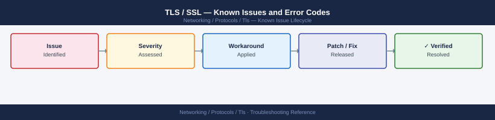

---
tags:
  - troubleshooting
  - tls
  - networking
  - certificates
  - known-issues
description: "Catalog of known TLS issues covering handshake failures, certificate validation errors, and version/cipher compatibility."
---
# TLS / SSL — Known Issues and Error Codes

<div class="kb-summary">
Catalog of known TLS issues covering handshake failures, certificate validation errors, and version/cipher compatibility.

*Applies to: TLS 1.2 / 1.3*
</div>



```d2
direction: down

symptom: Identify Symptom {shape: diamond}
handshake_failures: "Handshake Failures" {shape: rectangle}
certificate_errors: "Certificate Errors" {shape: rectangle}
tls_version_compatibility: "TLS Version Compatibility" {shape: rectangle}
resolution: Resolve or Escalate {shape: oval}

symptom -> handshake_failures: investigate
symptom -> certificate_errors: investigate
symptom -> tls_version_compatibility: investigate
handshake_failures -> resolution
certificate_errors -> resolution
tls_version_compatibility -> resolution
```

## Before you begin

- Diagnose with: `openssl s_client -connect <host>:443 -showcerts` — shows full certificate chain and TLS negotiation.
- TLS 1.0 and 1.1 are disabled by default on modern operating systems and browsers.
- Check both sides: server must support a cipher/version that the client supports.

## Handshake Failures

| Error / Symptom | Cause | Workaround / Fix |
|---|---|---|
| `SSL_ERROR_NO_CYPHER_OVERLAP` (Firefox) / `ERR_SSL_VERSION_OR_CIPHER_MISMATCH` (Chrome) | Client and server have no common TLS version or cipher suite | Enable TLS 1.2/1.3 on server; update legacy server software |
| `SSL3_GET_SERVER_CERTIFICATE:certificate verify failed` | Server certificate chain not trusted by client | Install CA certificate in client trust store; verify intermediate CA chain is complete |
| TLS handshake timeout | Server not responding on TLS port; or firewall dropping TLS traffic silently | Verify TCP connectivity: `nc -zv <host> 443`; check firewall for TLS inspection blocking |

## Certificate Errors

| Error / Symptom | Cause | Workaround / Fix |
|---|---|---|
| `Certificate has expired` | Server certificate past NotAfter date | Renew certificate; automate with ACME/Certbot |
| `hostname mismatch` | Certificate CN/SAN doesn't match the hostname being accessed | Reissue certificate with correct SAN for all hostnames |
| `self-signed certificate in certificate chain` | Intermediate or root CA is self-signed and not trusted | Add self-signed CA to client trust store; or use a trusted CA |

## TLS Version Compatibility

| Error / Symptom | Cause | Workaround / Fix |
|---|---|---|
| Legacy application fails after TLS 1.0/1.1 disabled on server | Application hardcoded TLS 1.0 | Update application to support TLS 1.2+; or use TLS termination proxy |
| Mutual TLS (mTLS) failing: `certificate required` | Client not presenting certificate | Configure client certificate in application; verify client cert issued by server-trusted CA |

## See also

