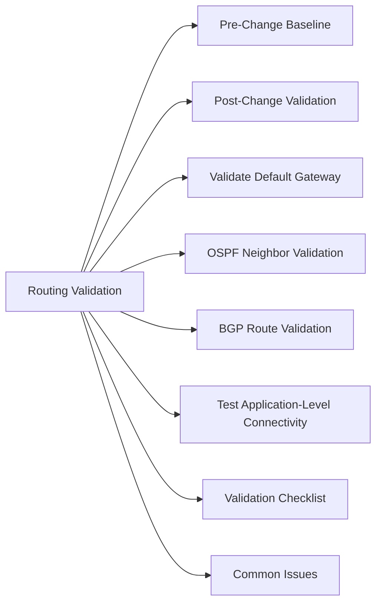

# Routing Validation

Verify routing paths are correct before and after network changes.



## Pre-Change Baseline

```bash
# Capture current route table
ip route show > /tmp/routes-before.txt

# Capture traceroute to critical destinations
traceroute <production_host> >> /tmp/routes-before.txt
traceroute <storage_vip> >> /tmp/routes-before.txt
traceroute <replication_peer> >> /tmp/routes-before.txt
```

## Post-Change Validation

```bash
# Compare route tables
ip route show > /tmp/routes-after.txt
diff /tmp/routes-before.txt /tmp/routes-after.txt

# Confirm specific routes still present
ip route get <destination>

# Trace paths to critical systems
traceroute <production_host>
traceroute <storage_vip>
```

## Validate Default Gateway

```bash
ip route show default
ping <gateway_ip>
```

## OSPF Neighbor Validation

```bash
show ip ospf neighbor            # all neighbors in FULL state
show ip ospf neighbor <id>       # specific neighbor detail
show ip route ospf               # routes learned via OSPF
```

## BGP Route Validation

```bash
show bgp summary                  # peer state: Established
show bgp neighbors <ip> routes    # routes received from peer
```

## Test Application-Level Connectivity

```bash
# Confirm key services reachable after routing change
nc -zv <storage_vip> 443    # storage management
nc -zv <vcenter_fqdn> 443   # vCenter
curl -k https://<app_vip>/  # application VIP
```

## Validation Checklist

- [ ] Route table contains all expected routes
- [ ] Default gateway reachable
- [ ] OSPF/BGP neighbors in expected state
- [ ] Traceroute paths unchanged (or correctly changed)
- [ ] Storage, backup, and replication traffic routing correctly
- [ ] Application connectivity confirmed

## Common Issues

| Issue | Check | Action |
|---|---|---|
| Route missing post-change | Route table diff | Restore static route or fix dynamic routing |
| OSPF adjacency lost | MTU, auth, hello timers | Match config on both ends |
| BGP peer down | Peer state | Check ACLs, peer address, ASN |
| Traffic taking wrong path | Metric or admin distance | Adjust metric or route preference |
