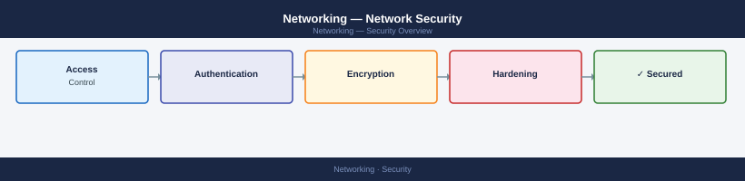

---
tags:
  - networking
  - security
---
# Networking — Network Security



```bash
nc -zv destination-host port
telnet destination-host port
ss -tulnp
```

```bash
# From a host behind the firewall
ping <destination>
traceroute <destination>
curl -v telnet://<dest>:<port>    # test specific TCP port

# From Linux — test TCP port
nc -zv <host> <port>
```
```bash
# PAN-OS
show log traffic action=deny | last 100

# Linux iptables
iptables -L -v -n | grep DROP
journalctl | grep "DPT=<port>"
```
```bash
# Identify which policy matched a session (PAN-OS)
show session all filter destination <ip> destination-port <port>
```
```bash
show running nat-policy           # PAN-OS
show ip nat translations          # Cisco IOS
```
```bash
show vpn-sessiondb                  # all active VPN sessions
show crypto ikev2 sa                # IKEv2 Phase 1 status
show crypto ipsec sa                # IPsec Phase 2 status
show crypto ikev1 sa                # IKEv1 Phase 1
show crypto isakmp sa               # IKEv1 ISAKMP
```
```bash
show vpn ike-sa
show vpn ipsec-sa
show vpn tunnel
```
```bash
ping <remote_subnet_ip> source <local_subnet_ip>
traceroute <remote_ip>
```
```bash
# Check certificate validity
openssl x509 -in <cert_file> -noout -dates

# Check PKI enrollment status (Cisco IOS)
show crypto pki certificate
```
```bash
# Cisco IOS — view VTI state
show interface tunnel <id>
show ip route | grep tunnel
```

## Before you begin

- **Access:** Network admin credentials; console or SSH to devices
- **Change management:** security changes require CAB approval in most environments
- **Rollback plan:** document current state before any security control change
- **Testing:** validate in a non-production environment first where possible

---

