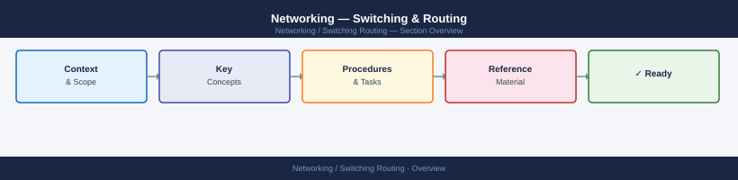

---
tags:
  - networking
---
# Networking — Switching & Routing



```bash
show vlan brief
show vlan id <id>
show interfaces trunk
show interface <int> status
```

```bash
interface <int>
  switchport mode trunk
  switchport trunk allowed vlan <id1>,<id2>
  switchport trunk native vlan <native_id>
```
```bash
switchport trunk allowed vlan add <id>
switchport trunk allowed vlan remove <id>
```
```bash
# Confirm VLAN exists
show vlan brief | include <id>

# Confirm port is in correct VLAN
show interface <int> status

# Confirm VLAN crosses trunk
show interfaces trunk | include <id>

# End-to-end test
ping <ip_on_same_vlan>
```
```bash
configure terminal
vlan <id>
  name <vlan_name>
exit
```
```bash
interface <int>
  switchport mode access
  switchport access vlan <id>
  description <description>
  no shutdown
exit
```
```bash
interface <int>
  switchport mode trunk
  switchport trunk encapsulation dot1q    # if required by platform
  switchport trunk native vlan <native_id>
  switchport trunk allowed vlan <id1>,<id2>,<id3>
  no shutdown
exit
```
```bash
interface <int>
  switchport trunk allowed vlan add <id>
```
```bash
interface <int>
  switchport trunk allowed vlan remove <id>
```
```bash
copy running-config startup-config
# or (NX-OS)
copy running-config startup-config vdc-all
```
```bash
# Confirm VLAN exists
show vlan brief | include <id>

# Confirm port VLAN assignment
show interface <int> status

# Confirm trunk carries VLAN
show interfaces trunk | include <id>

# Confirm VLAN on both sides of a trunk
# (Run on both switches)
```
```bash
ip route show
ip route get <destination_ip>    # show which route would be used
```
```cmd
route print
```
```bash
show ip route
show ip route <destination>
show ip route summary
```
```bash
# Linux — confirm default route
ip route show default

# Windows
route print 0.0.0.0
```
```bash
# Check OSPF neighbor state
show ip ospf neighbor

# Verify OSPF routes
show ip route ospf

# OSPF interface status
show ip ospf interface brief
```
```bash
# BGP summary (neighbor states)
show bgp summary
show bgp neighbors <ip>

# BGP routes
show bgp
show bgp routes
```
```bash
# Linux — add a static route
ip route add <network>/<prefix> via <gateway>

# Persist (add to /etc/network/interfaces or nmcli)
nmcli connection modify <conn> +ipv4.routes "<network>/<prefix> <gateway>"
```
```bash
traceroute <destination>    # Linux
tracert <destination>       # Windows
```
```bash
# Capture current route table
ip route show > /tmp/routes-before.txt

# Capture traceroute to critical destinations
traceroute <production_host> >> /tmp/routes-before.txt
traceroute <storage_vip> >> /tmp/routes-before.txt
traceroute <replication_peer> >> /tmp/routes-before.txt
```
```bash
# Compare route tables
ip route show > /tmp/routes-after.txt
diff /tmp/routes-before.txt /tmp/routes-after.txt

# Confirm specific routes still present
ip route get <destination>

# Trace paths to critical systems
traceroute <production_host>
traceroute <storage_vip>
```
```bash
ip route show default
ping <gateway_ip>
```
```bash
show ip ospf neighbor            # all neighbors in FULL state
show ip ospf neighbor <id>       # specific neighbor detail
show ip route ospf               # routes learned via OSPF
```
```bash
show bgp summary                  # peer state: Established
show bgp neighbors <ip> routes    # routes received from peer
```
```bash
# Confirm key services reachable after routing change
nc -zv <storage_vip> 443    # storage management
nc -zv <vcenter_fqdn> 443   # vCenter
curl -k https://<app_vip>/  # application VIP
```
```bash
# Linux — ipcalc
ipcalc 10.10.10.0/24

# Python one-liner
python3 -c "import ipaddress; n = ipaddress.ip_network('10.10.10.0/24'); print(n.network_address, n.broadcast_address, n.num_addresses)"
```
```bash
ipcalc 10.10.10.45/24
# Returns: network, broadcast, first/last usable host
```
```bash
python3 -c "
import ipaddress
a = ipaddress.ip_address('10.10.10.45')
b = ipaddress.ip_address('10.10.10.200')
net = ipaddress.ip_network('10.10.10.0/24')
print(a in net, b in net)
"
```
```bash
# Linux — show all routes
ip route show

# Check for overlap manually or with ipcalc
ipcalc <new_network>/<prefix>
```
```bash
ip addr show
ip addr show <interface>
ip addr add <ip>/<prefix> dev <interface>
ip route add default via <gateway>
```
```powershell
Get-NetIPAddress
Get-NetIPConfiguration
ipconfig /all
```
```bash
# Test TCP port reachability
nc -zv <host> <port>
telnet <host> <port>

# PowerShell
Test-NetConnection <host> -Port <port>
```
```bash
# Linux
ss -tnp         # TCP connections with process info
ss -tnlp        # listening ports
netstat -tnp    # legacy equivalent

# Windows
netstat -ano
Get-NetTCPConnection
```
```bash
# Check interface MTU
ip link show <interface>

# Test path MTU (don't-fragment bit)
ping -M do -s 1472 <destination>    # 1500 MTU test
ping -M do -s 8972 <destination>    # 9000 MTU test

# Windows
ping /f /l 1472 <destination>
```
