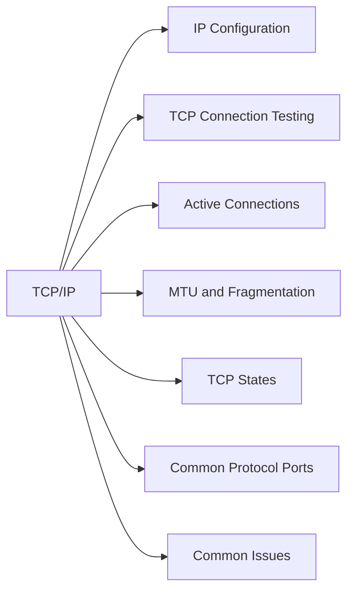

# TCP/IP



## IP Configuration

**Linux:**
```bash
ip addr show
ip addr show <interface>
ip addr add <ip>/<prefix> dev <interface>
ip route add default via <gateway>
```

**Windows:**
```powershell
Get-NetIPAddress
Get-NetIPConfiguration
ipconfig /all
```

## TCP Connection Testing

```bash
# Test TCP port reachability
nc -zv <host> <port>
telnet <host> <port>

# PowerShell
Test-NetConnection <host> -Port <port>
```

## Active Connections

```bash
# Linux
ss -tnp         # TCP connections with process info
ss -tnlp        # listening ports
netstat -tnp    # legacy equivalent

# Windows
netstat -ano
Get-NetTCPConnection
```

## MTU and Fragmentation

Default Ethernet MTU is 1500 bytes. Storage networks (iSCSI, NFS) typically use jumbo frames (9000 bytes). Mismatches cause fragmentation or dropped packets.

```bash
# Check interface MTU
ip link show <interface>

# Test path MTU (don't-fragment bit)
ping -M do -s 1472 <destination>    # 1500 MTU test
ping -M do -s 8972 <destination>    # 9000 MTU test

# Windows
ping /f /l 1472 <destination>
```

## TCP States

| State | Meaning |
|---|---|
| ESTABLISHED | Active connection |
| TIME_WAIT | Connection closing; waiting for delayed packets |
| CLOSE_WAIT | Remote side closed; local app hasn't closed yet |
| SYN_SENT | TCP handshake in progress |
| LISTEN | Port open and listening |

## Common Protocol Ports

| Protocol | Port |
|---|---|
| SSH | 22 |
| HTTPS | 443 |
| iSCSI | 3260 |
| NFS | 2049 |
| SMB/CIFS | 445 |
| DNS | 53 (UDP/TCP) |
| LDAP | 389 |
| LDAPS | 636 |
| NTP | 123 (UDP) |
| SNMP | 161/162 (UDP) |

## Common Issues

| Issue | Check | Action |
|---|---|---|
| Can't reach port | Firewall, service down | `nc -zv`; check firewall and service |
| High TIME_WAIT count | Short connection pattern | Tune `net.ipv4.tcp_tw_reuse` |
| MTU causing drops | Path MTU | Lower MTU or fix network |
| Intermittent loss | Duplex mismatch | Force full duplex on NIC and switch |
