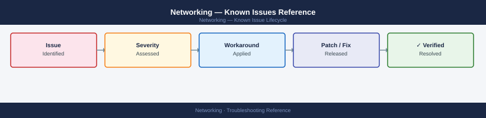

---
tags:
  - troubleshooting
  - networking
  - known-issues
---
# Networking — Known Issues Reference

<div class="kb-summary">
Index of protocol-specific known issues and error codes for networking components. This top-level page links to per-protocol known-issues catalogs.

*Applies to: All network protocols in this KB*
</div>



```d2
direction: down

symptom: Identify Symptom {shape: diamond}
protocol_knownissues_pages: "Protocol Known-Issues Pages" {shape: rectangle}
resolution: Resolve or Escalate {shape: oval}

symptom -> protocol_knownissues_pages: investigate
protocol_knownissues_pages -> resolution
```

## Before you begin

For network issues, identify the protocol layer first before looking up specific errors:
- **Layer 3** (IP routing, VPN) → check routing tables, MTU, firewall logs
- **Layer 4** (TCP/UDP port) → check firewall rules, port open/close status
- **Layer 7** (application protocol) → check the specific protocol known-issues page below

## Protocol Known-Issues Pages

| Protocol | Known Issues |
|---|---|
| DNS | [DNS — Known Issues](protocols/dns/troubleshooting/known-issues/) |
| NFS | [NFS — Known Issues](protocols/nfs/troubleshooting/known-issues/) |
| SMB / CIFS | [SMB — Known Issues](protocols/smb/troubleshooting/known-issues/) |
| iSCSI | [iSCSI — Known Issues](protocols/iscsi/troubleshooting/known-issues/) |
| Fibre Channel | [FC — Known Issues](protocols/fibre-channel/troubleshooting/known-issues/) |
| TLS / SSL | [TLS — Known Issues](protocols/tls/troubleshooting/known-issues/) |
| LDAP / LDAPS | [LDAP — Known Issues](protocols/ldap/troubleshooting/known-issues/) |

## See also

- [Networking — Common Issues](index.md)
