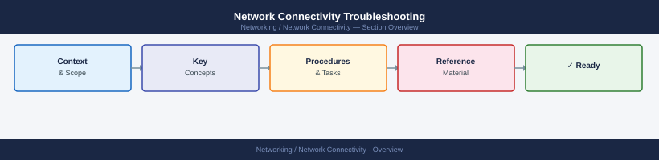
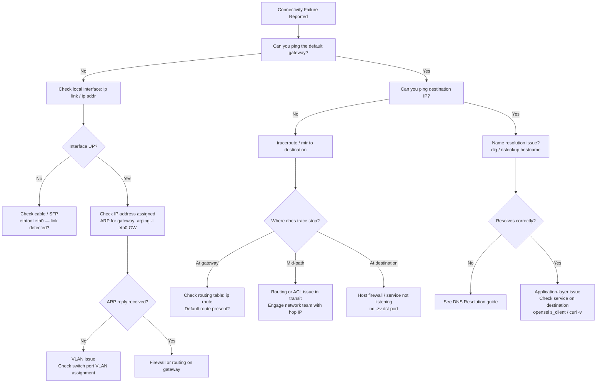

---
tags:
  - networking
  - troubleshooting
search:
  boost: 1.5
---
# Network Connectivity Troubleshooting


<div class="kb-summary">
Network Connectivity Troubleshooting reference covering Overview, Failure Classification by OSI Layer, Diagnostic Flowchart, VLAN and Trunk Verification, Routing Table Verification and 6 more sections.
</div>



## Before you begin

- **Access:** Network admin credentials; console or SSH to devices
- **Gather first:** recent error message text, event timestamps, and affected object names
- **Scope:** confirm whether the issue affects a single object, host, cluster, or site
- **Escalation:** open a vendor support ticket before running any destructive step
- **Logging:** document each command and output — required if escalation is needed

---

## Overview

Network failures must be diagnosed by layer — jumping straight to firewall rules wastes time when the issue is a downed physical link or a misconfigured VLAN. This guide follows the OSI model from physical through application, with enterprise tools for Linux, Windows, Cisco, and VMware ESXi environments.

---

## Failure Classification by OSI Layer

| Layer | Common Failure | First Symptom | Diagnostic Tool |
|---|---|---|---|
| L1 — Physical | Cable/SFP down | Link down LED; interface counters 0 | `ethtool eth0`; switch port light |
| L2 — Data Link | VLAN misconfiguration | Ping fails on same subnet | `ip link`; `show interfaces trunk` |
| L2 — Data Link | Spanning tree loop | Broadcast storm; high CPU on switch | `show spanning-tree` |
| L3 — Network | Routing missing | Can ping gateway, not remote host | `ip route`; `traceroute` |
| L3 — Network | ACL blocking | Traceroute shows *; ping fails | `show ip access-lists` |
| L4 — Transport | Firewall blocking port | TCP connect timeout | `nc -zv host port`; `telnet` |
| L4 — Transport | MTU mismatch | Large transfers fail; small ping ok | `ping -M do -s 8972` |
| L7 — Application | TLS certificate failure | HTTPS connection refused | `openssl s_client` |
| L7 — Application | DNS failure | Name not resolved | `dig`; `nslookup` |

---

## Diagnostic Flowchart




---

## VLAN and Trunk Verification

### Cisco

```text
! Show all trunk ports and allowed VLANs
show interfaces trunk

! Example output:
! Port        Mode         Encapsulation  Status        Native vlan
! Gi0/1       on           802.1q         trunking      1
! Port        Vlans allowed on trunk
! Gi0/1       1-4094
! Port        Vlans allowed and active in management domain
! Gi0/1       1,10,20,100,200,300

! Check specific port VLAN assignment (access port)
show interfaces GigabitEthernet0/2 switchport

! Expected for access port:
! Administrative Mode: static access
! Access Mode VLAN: 100

! Verify VLAN exists in database
show vlan id 100
```

### Linux (802.1Q VLAN interface)

```bash
# Check VLAN interfaces defined on host
cat /proc/net/vlan/config
# VLAN Dev name    | VLAN ID
# eth0.100         | 100  | eth0
# eth0.200         | 200  | eth0

# Check VLAN interface stats
ip -d link show eth0.100
```

---

## Routing Table Verification

### Linux

```bash
# Show full routing table
ip route show

# Example:
# default via 10.10.1.1 dev eth0 proto static metric 100
# 10.10.1.0/24 dev eth0 proto kernel scope link src 10.10.1.55
# 10.20.0.0/16 via 10.10.1.254 dev eth0 proto static   ← storage network route

# Find route for a specific destination
ip route get 10.20.5.100

# Expected:
# 10.20.5.100 via 10.10.1.254 dev eth0 src 10.10.1.55
#    cache

# Missing route → add static route (temporary)
ip route add 10.20.0.0/16 via 10.10.1.254 dev eth0
```

### Cisco

```text
! Show full routing table
show ip route

! Show route for specific destination
show ip route 10.20.5.100

! Check OSPF neighbours (dynamic routing)
show ip ospf neighbor

! Check BGP peers (if in use)
show bgp summary
```

---

## Firewall Rule Testing

```bash
# Test TCP port reachability (nc = netcat)
nc -zv 10.10.5.20 443
# Connection to 10.10.5.20 443 port [tcp/https] succeeded!

# Test UDP port
nc -zuv 10.10.1.10 53

# Test multiple ports in range
for port in 2500 2501 2502 3300; do
    nc -zv 10.20.1.50 $port 2>&1 | grep -E "succeeded|refused|timed out"
done

# Test with timeout (avoid long hangs)
nc -zv -w 3 10.10.5.20 8080

# Windows equivalent
Test-NetConnection -ComputerName 10.10.5.20 -Port 443

# Curl for HTTP/HTTPS with full header details
curl -v --connect-timeout 10 https://app01.corp.example.com/health

# OpenSSL TLS test
openssl s_client -connect app01.corp.example.com:443 -servername app01.corp.example.com
```

---

## MTU and Jumbo Frame Issues

MTU mismatches cause large packet failures while small pings succeed — common in storage networks (iSCSI, NFS over 10GbE with jumbo frames).

```bash
# Test if path supports jumbo frames (9000 byte MTU — payload 8972 = 9000 - 28)
ping -M do -s 8972 10.20.1.50
# If MTU mismatch: "From 10.10.1.1 icmp_seq=1 Frag needed and DF set (mtu = 1500)"
# If path OK: normal ping reply

# Progressive MTU test (binary search)
for size in 8972 4096 2048 1472; do
    result=$(ping -M do -s $size -c 1 -W 2 10.20.1.50 2>&1)
    echo "Size $size: $(echo $result | grep -o 'Frag needed\|1 received\|timeout')"
done

# Check MTU on interface
ip link show eth0 | grep mtu
# 2: eth0: <BROADCAST,MULTICAST,UP,LOWER_UP> mtu 9000 ...

# Set MTU (temporary)
ip link set eth0 mtu 9000

# VMware ESXi: check vSwitch MTU
esxcli network vswitch standard list | grep -i mtu
```

---

## ARP Table and MAC Address Checks

```bash
# Show ARP table — verify gateway MAC is present
ip neigh show

# Example:
# 10.10.1.1 dev eth0 lladdr 00:50:56:ab:cd:ef REACHABLE  ← good
# 10.10.1.100 dev eth0  FAILED                            ← host unreachable / no ARP reply

# Send ARP request manually
arping -I eth0 10.10.1.100

# Flush ARP cache for a specific entry (force re-ARP)
ip neigh del 10.10.1.100 dev eth0

# Show MAC address table on Cisco switch (find which port a MAC is on)
# show mac address-table address 00:50:56:ab:cd:ef
! Vlan    Mac Address       Type        Ports
! 100    0050.56ab.cdef    DYNAMIC     Gi0/5
```

---

## Common Failure Patterns

| Scenario | Symptom | Root Cause | Fix |
|---|---|---|---|
| Storage network unreachable | iSCSI/NFS timeouts; VM disk I/O errors | Missing static route to storage VLAN | Add route to storage network on hosts |
| vMotion fails | "A general system error occurred" in vCenter | vMotion VMkernel NIC not in correct VLAN | Verify vmk1 VLAN and MTU (9000) |
| Backup timeouts | Veeam job fails after 30 min; network error | Jumbo frames misconfigured on backup NIC | Match MTU between proxy and repo |
| Cross-site connectivity fails | Traceroute stops at WAN router | BGP/OSPF peering down | Check routing protocol peering |
| New VM cannot reach gateway | Ping to GW fails | Wrong port group / VLAN assigned in vCenter | Fix VM network adapter port group |
| Intermittent packet loss | 1–5% loss detected by mtr | Duplex mismatch or bad SFP | Check ethtool duplex; replace SFP |
| SMTP relay fails | Mail not delivered; NDR with connection error | Port 25 blocked at perimeter firewall | Request firewall rule for relay IP |
| Application cluster split-brain | Both nodes think the other is down | NIC bonding failover bug or heartbeat VLAN down | Check bond status; restore heartbeat VLAN |

---

## mtr Analysis and Output Interpretation

```bash
# Run mtr in report mode (12 cycles)
mtr --report --report-cycles 12 10.10.5.20

# Example output:
# HOST: app01.corp.example.com     Loss%   Snt   Last   Avg  Best  Wrst StDev
#   1.|-- 10.10.1.1                 0.0%    12    0.3   0.4   0.3   0.6   0.1
#   2.|-- 10.10.0.1                 0.0%    12    0.8   0.9   0.7   1.2   0.1
#   3.|-- 10.10.5.20                0.0%    12    1.1   1.2   1.0   1.5   0.1

# Interpretation:
# Loss% at hop N but not hop N+1 = router ICMP rate-limiting (not real loss)
# Loss% at final hop = real packet loss to destination
# Wrst >> Avg at a hop = intermittent congestion or flapping link
```

---

## Escalation Criteria

Escalate to network or data centre team when:

- Physical link is down and requires hands-on cabling or SFP replacement
- Spanning tree topology change is causing broadcast storms
- Routing protocol (OSPF/BGP) peering is down between core routers
- ACL changes are required on perimeter or core firewall
- VLAN misconfiguration requires switch configuration change (change management)
- Packet loss >1% is sustained across a core link (SLA breach)
- Storage network is unreachable — iSCSI or NFS failures causing active VM I/O errors
- WAN circuit outage — engage carrier via NOC

---

## Verify resolution

- Confirm the original symptom no longer occurs
- Check logs for any residual errors related to the issue
- Monitor for 10–15 minutes to confirm the fix is stable

## See also

- [DNS Resolution Troubleshooting](../dns-resolution/)
- [Networking — Known Issues](../known-issues.md)
- [Networking — Troubleshooting Overview](../)
