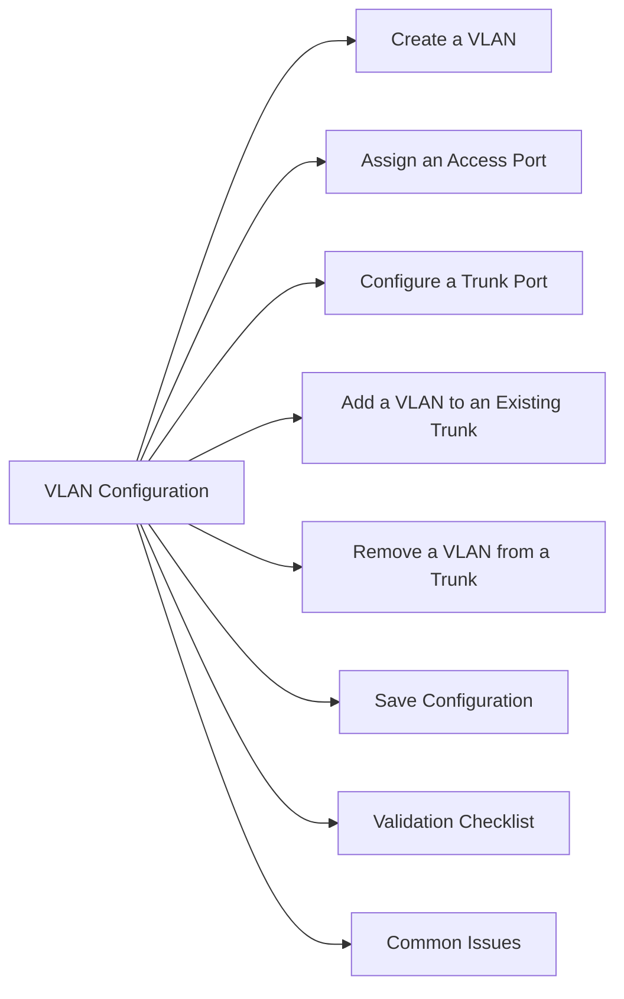

# VLAN Configuration

Step-by-step procedures for creating and assigning VLANs on Cisco IOS/NX-OS switches.



## Create a VLAN

```bash
configure terminal
vlan <id>
  name <vlan_name>
exit
```

## Assign an Access Port

```bash
interface <int>
  switchport mode access
  switchport access vlan <id>
  description <description>
  no shutdown
exit
```

## Configure a Trunk Port

```bash
interface <int>
  switchport mode trunk
  switchport trunk encapsulation dot1q    # if required by platform
  switchport trunk native vlan <native_id>
  switchport trunk allowed vlan <id1>,<id2>,<id3>
  no shutdown
exit
```

## Add a VLAN to an Existing Trunk

```bash
interface <int>
  switchport trunk allowed vlan add <id>
```

## Remove a VLAN from a Trunk

```bash
interface <int>
  switchport trunk allowed vlan remove <id>
```

## Save Configuration

```bash
copy running-config startup-config
# or (NX-OS)
copy running-config startup-config vdc-all
```

## Validation Checklist

```bash
# Confirm VLAN exists
show vlan brief | include <id>

# Confirm port VLAN assignment
show interface <int> status

# Confirm trunk carries VLAN
show interfaces trunk | include <id>

# Confirm VLAN on both sides of a trunk
# (Run on both switches)
```

After VLAN config:
- [ ] VLAN visible in `show vlan brief` on all relevant switches
- [ ] Trunk carries VLAN — `show interfaces trunk`
- [ ] End-host reachable — `ping <host_on_vlan>`
- [ ] Storage / application traffic flowing

## Common Issues

| Issue | Check | Action |
|---|---|---|
| VLAN not passing | Trunk allowed list | `switchport trunk allowed vlan add` |
| Host not on VLAN | Access port assignment | `switchport access vlan <id>` |
| Native VLAN mismatch | CDP/LLDP warnings | Match native VLAN on both trunk ends |
| VLAN pruned by VTP | VTP mode | Set to transparent or manually add VLAN |
