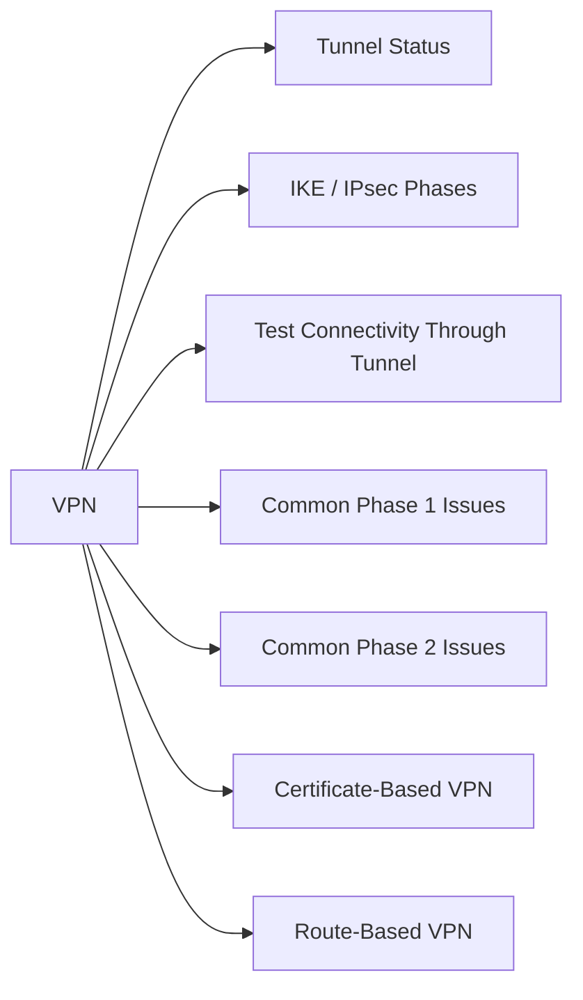

# VPN

VPNs provide encrypted connectivity between sites, cloud environments, remote users, and partner networks.



## Tunnel Status

**Cisco ASA / IOS:**
```bash
show vpn-sessiondb                  # all active VPN sessions
show crypto ikev2 sa                # IKEv2 Phase 1 status
show crypto ipsec sa                # IPsec Phase 2 status
show crypto ikev1 sa                # IKEv1 Phase 1
show crypto isakmp sa               # IKEv1 ISAKMP
```

**Palo Alto:**
```bash
show vpn ike-sa
show vpn ipsec-sa
show vpn tunnel
```

## IKE / IPsec Phases

| Phase | Protocol | Purpose |
|---|---|---|
| Phase 1 (IKE) | ISAKMP/IKEv2 | Establish authenticated, encrypted channel |
| Phase 2 | IPsec | Negotiate encryption for data tunnels |

Both phases must complete for a functional tunnel.

## Test Connectivity Through Tunnel

```bash
ping <remote_subnet_ip> source <local_subnet_ip>
traceroute <remote_ip>
```

## Common Phase 1 Issues

| Issue | Cause | Fix |
|---|---|---|
| No response from peer | Firewall blocking UDP 500/4500 | Open UDP 500 and 4500 |
| Authentication failed | Mismatched PSK or certificate | Verify PSK or certificate chain |
| Proposal mismatch | Different encryption/hash settings | Match DH group, encryption, hash on both ends |

## Common Phase 2 Issues

| Issue | Cause | Fix |
|---|---|---|
| Tunnel up, no traffic | Proxy IDs / ACL mismatch | Match encryption domain (interesting traffic) on both ends |
| Traffic one-directional | Asymmetric routing | Check routing on remote peer |
| Tunnel drops intermittently | SA lifetime mismatch | Match Phase 2 lifetime on both peers |

## Certificate-Based VPN

```bash
# Check certificate validity
openssl x509 -in <cert_file> -noout -dates

# Check PKI enrollment status (Cisco IOS)
show crypto pki certificate
```

## Route-Based VPN

Route-based VPNs use virtual tunnel interfaces (VTI) — routing directs traffic into the tunnel rather than ACLs:

```bash
# Cisco IOS — view VTI state
show interface tunnel <id>
show ip route | grep tunnel
```
