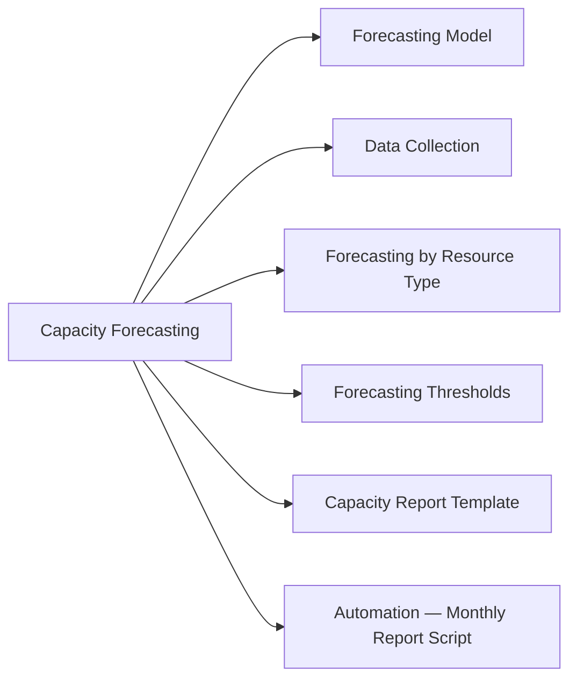

# Capacity Forecasting

Capacity forecasting predicts when a resource will be exhausted based on historical trend data, enabling proactive expansion before impact occurs.



## Forecasting Model

```
Days to exhaustion = (Current capacity - Current usage) / Growth rate per day
```

Use a 30–90 day trailing average for growth rate — avoid using peak outliers to inflate the rate.

## Data Collection

**Linux — capture weekly snapshots:**
```bash
# CPU average (last 7 days via sar)
sar -u -f /var/log/sa/sa$(date -d '7 days ago' +%d) | tail -3

# Disk usage over time (append to trend file)
df -h | awk '{print strftime("%Y-%m-%d"), $0}' >> /var/log/capacity/disk-$(date +%Y%m).log
```

**ONTAP — volume capacity trend:**
```bash
volume show -fields size,used,percent-used
# Track weekly: write to external metrics store or pull via REST API
```

**Pure FlashArray:**
```bash
purecli volume list --space   # per-volume capacity
purecli array get             # array-wide reduction ratio and used capacity
```

## Forecasting by Resource Type

### Storage

```bash
# Current usage and growth estimate
df -h /data
# Compare with last month's snapshot
# If usage grows 50 GB/month and 200 GB free → 4 months to full

# ONTAP aggregate capacity
storage aggregate show -fields size,used,percent-used,availsize
```

### Compute (CPU/Memory)

```bash
# Average CPU over last 30 days from sar
for day in $(seq 1 30); do
  sar -u -f /var/log/sa/sa$(date -d "$day days ago" +%d) 2>/dev/null | \
    awk '/Average/ {print $3}' | tail -1
done | awk '{sum+=$1; count++} END {print "30d avg CPU:", sum/count "%"}'
```

### Network

```bash
# Interface utilisation trend (sar)
sar -n DEV 1 10 | grep eth0
# Historical: sar -n DEV -f /var/log/sa/saDD
```

## Forecasting Thresholds

| Resource | Alert at | Plan expansion at |
|---|---|---|
| Storage (array/volume) | 75% used | 60 days to full |
| CPU (sustained avg) | >70% | >60% sustained trend |
| Memory | >80% | >75% sustained trend |
| Network (sustained) | >60% of link speed | >50% sustained trend |
| Backup window | >90% of allowed window | 75% |

## Capacity Report Template

```markdown
Date:          2026-05-06
System:        prod-storage-01 (ONTAP)
Current Usage: 68% (34 TB / 50 TB)
Growth rate:   ~400 GB/month (3-month avg)
Days to 85%:   ~105 days (est. mid-August)
Days to 100%:  ~180 days (est. November)

Recommendation:
  Order 20 TB additional capacity by July.
  Submit hardware request by 2026-06-01 (6-week lead time).
```

## Automation — Monthly Report Script

```bash
#!/bin/bash
echo "=== Capacity Forecast $(date +%Y-%m-%d) ==="
df -h | awk 'NR>1 && $5+0 > 70 {print "WARNING:", $6, "at", $5}'
echo ""
echo "Storage volumes near capacity:"
# Add ONTAP/Pure/array CLI calls here for production use
```
