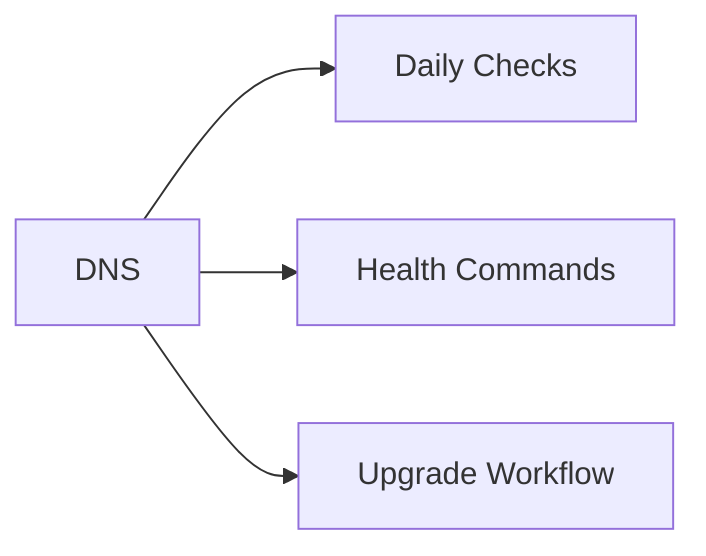

# DNS


<div class="kb-grid kb-grid-1">

<a class="kb-card" href="lookups/">
  <strong>Lookups</strong>
  <span>Lookups notes, checks, commands, and references.</span>
</a>

<a class="kb-card" href="troubleshooting/">
  <strong>Troubleshooting</strong>
  <span>Common issues, diagnostic steps, and resolution guides.</span>
</a>

</div>



## Overview

DNS resolves names to IP addresses and is a critical dependency for authentication, applications, storage, cloud services, monitoring, and automation.

## Daily Checks


| Check | Command | Notes |
|---|---|---|
| Verify forward and reverse lookup |  |  |
| Confirm DNS server availability |  |  |
| Review stale or duplicate records |  |  |
| Check zone replication |  |  |
| Validate conditional forwarders |  |  |

## Health Commands

```bash
nslookup example.com
dig example.com
dig -x 10.0.0.10
ipconfig /displaydns
```

## Upgrade Workflow

1. Export or back up DNS zones
2. Confirm replication health
3. Apply OS or DNS service updates
4. Validate name resolution
5. Confirm dependent applications are healthy
