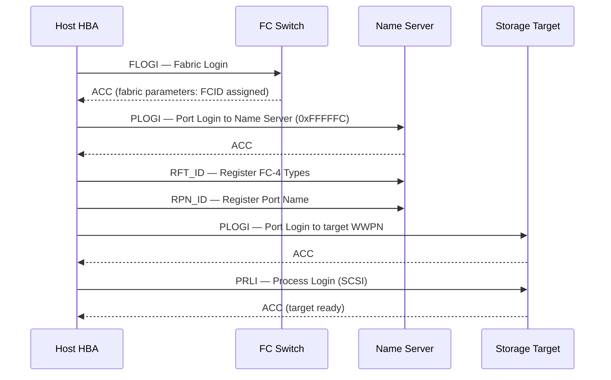

# Fabric Login

Fabric login is the process by which FC ports register with the fabric and establish communication paths.

```
        FC LOGIN SEQUENCE
┌──────────┐        ┌───────────┐        ┌───────────┐
│ Host HBA │        │ FC Switch │        │  Storage  │
│          │        │(Name Svr) │        │  Target   │
└────┬─────┘        └─────┬─────┘        └─────┬─────┘
     │  1. FLOGI           │                    │
     │ ──────────────────► │                    │
     │  ACC (FC_ID assigned)│                   │
     │ ◄────────────────── │                    │
     │  2. PLOGI (to NS)   │                    │
     │ ──────────────────► │                    │
     │  ACC                │                    │
     │ ◄────────────────── │                    │
     │  3. RFT_ID / RPN_ID │                    │
     │ ──────────────────► │                    │
     │                     │  4. PLOGI (port-to-port)
     │ ───────────────────────────────────────► │
     │                     │  ACC               │
     │ ◄─────────────────────────────────────── │
     │                     │  5. PRLI (SCSI session)
     │ ───────────────────────────────────────► │
     │                     │  ACC (target ready) │
     │ ◄─────────────────────────────────────── │
     │                     │  I/O can begin     │
``` Login failures prevent hosts from seeing storage.

## Login Sequence



## Login Stages

| Stage | Description | Failure means |
|---|---|---|
| **FLOGI** | HBA registers with fabric, receives FCID | No fabric connectivity — check link, SFP, speed |
| **PLOGI** | Port-to-port login between two FC ports | Target unreachable — check zoning |
| **PRLI** | SCSI service parameter exchange | Upper-layer SCSI issue — driver or firmware |

## Viewing Login State

### Brocade FOS

```bash
# Show fabric logins on this switch
nsshow

# Show logins across all switches
nsallshow

# Show FLOGI database (ports logged into this switch's F_ports)
switchshow | grep Online

# Per-port FLOGI details
portlogshow <slot/port>
```

### Cisco MDS

```bash
# FLOGI database — who is logged in to the fabric
show flogi database vsan 10

# Name server — all registered ports
show fcns database vsan 10

# PLOGI state between two ports
show topology

# Detailed port login info
show interface fc1/1
```

## Common Login Failures

| Symptom | Probable cause | Action |
|---|---|---|
| FLOGI not in `nsshow` | Physical link down / SFP fault | Check `portshow`, clean/reseat SFP |
| FLOGI present but PLOGI fails | Zoning mismatch — target not in same zone | Verify zone contains both initiator and target WWPN |
| PRLI rejected | Target port in wrong state or driver mismatch | Check storage array port status and HBA driver version |
| FCID conflict after fabric merge | Duplicate domain IDs | Resolve domain ID conflict; perform fabric re-merge |
| Login loop / repeated FLOGI | HBA firmware bug or speed mismatch | Lock port speed on both switch and HBA |

## Useful Diagnostic Commands

```bash
# Brocade — port error counters (CRC, loss-of-sync)
porterrshow

# Brocade — port statistics
portstatshow <port>

# Cisco MDS — interface counters
show interface fc1/1 counters

# Verify FCID assigned to a WWPN
nsshow | grep <wwpn-last-4-chars>
```
