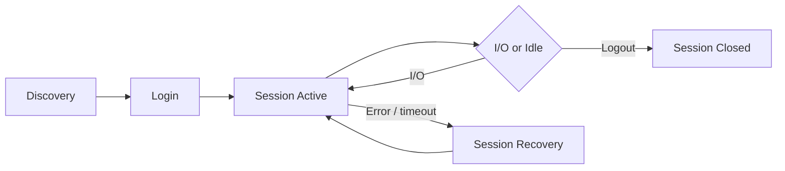

```text
┌──────────────┐                         ┌──────────────────┐
│  Initiator   │                         │     Target                                                   │
└──────┬───────┘                         └─────────┬────────┘
```
```text
Each session can carry multiple connections (TCP streams) for performance.

## Session Lifecycle

```


```bash
## List all active sessions (brief)
iscsiadm -m session

## Detailed session info (connections, state, target IQN)
iscsiadm -m session -P 3

## Show session parameters (timeouts, queue depth)
iscsiadm -m session -P 3 | grep -E "Target|State|Recovery|Queue"

## Session stats (bytes tx/rx, retries)
iscsiadm -m session -s
```
```bash
## Login to all discovered targets (persistent)
iscsiadm -m node --login

## Login to a specific target
iscsiadm -m node -T <IQN> -p <ip>:3260 --login

## Make login persistent across reboots
iscsiadm -m node -T <IQN> -p <ip>:3260 -o update -n node.startup -v automatic

## Logout from a target
iscsiadm -m node -T <IQN> -p <ip>:3260 --logout

## Logout all sessions
iscsiadm -m node --logoutall=all
```
```bash
## /etc/iscsi/iscsid.conf
node.session.nr_sessions = 2

## Or per-node override
iscsiadm -m node -T <IQN> -p <ip> -o update -n node.session.nr_sessions -v 2
```
```bash
## Check session state during recovery
iscsiadm -m session -P 3 | grep -i state

## Force session re-establishment
iscsiadm -m node -T <IQN> -p <ip>:3260 --logout
iscsiadm -m node -T <IQN> -p <ip>:3260 --login
```
