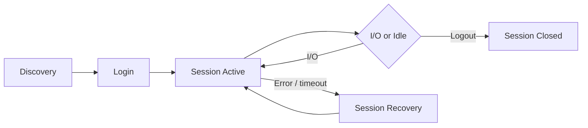

# iSCSI Sessions

An iSCSI session is a logical connection between an initiator and a target, established after discovery.

```
        SESSION SETUP SEQUENCE
┌──────────────┐                         ┌──────────────────┐
│  Initiator   │                         │     Target       │
└──────┬───────┘                         └─────────┬────────┘
       │  1. SendTargets discovery                  │
       │ ──────────────────────────────────────────►│
       │     target IQN + portal list               │
       │ ◄──────────────────────────────────────────│
       │  2. TCP connect to portal IP:3260          │
       │ ──────────────────────────────────────────►│
       │  3. Login Request (CHAP challenge)          │
       │ ──────────────────────────────────────────►│
       │     CHAP response / auth OK                │
       │ ◄──────────────────────────────────────────│
       │  4. Session Established                    │
       │ ◄═══════════════════════════════════════════│
       │  5. I/O (SCSI commands over TCP)           │
       │ ◄══════════════════════════════════════════►│
``` Each session can carry multiple connections (TCP streams) for performance.

## Session Lifecycle



## Viewing Sessions — Linux

```bash
# List all active sessions (brief)
iscsiadm -m session

# Detailed session info (connections, state, target IQN)
iscsiadm -m session -P 3

# Show session parameters (timeouts, queue depth)
iscsiadm -m session -P 3 | grep -E "Target|State|Recovery|Queue"

# Session stats (bytes tx/rx, retries)
iscsiadm -m session -s
```

## Key Session Parameters

| Parameter | Location | Notes |
|---|---|---|
| `node.session.timeo.replacement_timeout` | `/etc/iscsi/iscsid.conf` | How long to wait before failing a session (default 120s) |
| `node.conn.timeo.login_timeout` | iscsid.conf | TCP login attempt timeout |
| `node.session.queue_depth` | iscsid.conf | Outstanding commands per session (default 32) |
| `node.session.nr_sessions` | iscsid.conf | Sessions per target (set >1 for throughput) |

## Login / Logout

```bash
# Login to all discovered targets (persistent)
iscsiadm -m node --login

# Login to a specific target
iscsiadm -m node -T <IQN> -p <ip>:3260 --login

# Make login persistent across reboots
iscsiadm -m node -T <IQN> -p <ip>:3260 -o update -n node.startup -v automatic

# Logout from a target
iscsiadm -m node -T <IQN> -p <ip>:3260 --logout

# Logout all sessions
iscsiadm -m node --logoutall=all
```

## Multiple Sessions Per Target

For throughput, configure multiple sessions per target (each using a different NIC):

```bash
# /etc/iscsi/iscsid.conf
node.session.nr_sessions = 2

# Or per-node override
iscsiadm -m node -T <IQN> -p <ip> -o update -n node.session.nr_sessions -v 2
```

## Session Recovery

When a session encounters an error (network drop, array reboot), iSCSI attempts recovery before failing I/O to the OS. The `replacement_timeout` controls how long it waits.

```bash
# Check session state during recovery
iscsiadm -m session -P 3 | grep -i state

# Force session re-establishment
iscsiadm -m node -T <IQN> -p <ip>:3260 --logout
iscsiadm -m node -T <IQN> -p <ip>:3260 --login
```

## Common Issues

| Symptom | Cause | Check |
|---|---|---|
| Session not established after login | TCP port blocked or target not responding | `nc -zv <ip> 3260` |
| Session drops intermittently | Network instability or MTU mismatch | Check switch port errors, verify jumbo frames end-to-end |
| `replacement_timeout` alarms | Array or network outage > 120s | Adjust timeout or investigate root cause |
| High retries in session stats | Packet loss or congestion on storage network | Isolate iSCSI to dedicated VLAN, check QoS |
