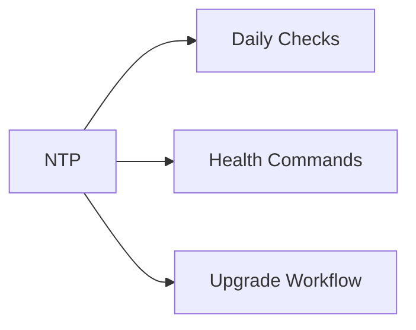

# NTP


<div class="kb-grid kb-grid-1">

<a class="kb-card" href="firewalls/">
  <strong>Firewalls</strong>
  <span>Firewalls notes, checks, commands, and references.</span>
</a>

<a class="kb-card" href="sync-state/">
  <strong>Sync State</strong>
  <span>Sync State notes, checks, commands, and references.</span>
</a>

<a class="kb-card" href="validation/">
  <strong>Validation</strong>
  <span>Validation notes, checks, commands, and references.</span>
</a>

</div>



## Overview

NTP keeps infrastructure time synchronized. Time drift can break authentication, certificates, logging, replication, clustering, and audit trails.

## Daily Checks


| Check | Command | Notes |
|---|---|---|
| Confirm time source is reachable |  |  |
| Check drift offset |  |  |
| Validate domain time hierarchy |  |  |
| Review time sync errors |  |  |

## Health Commands

```bash
ntpq -p
chronyc sources
timedatectl status
w32tm /query /status
```

## Upgrade Workflow

1. Confirm authoritative time sources
2. Update NTP or chrony configuration
3. Restart time service
4. Validate offset and synchronization
5. Monitor logs for drift warnings
