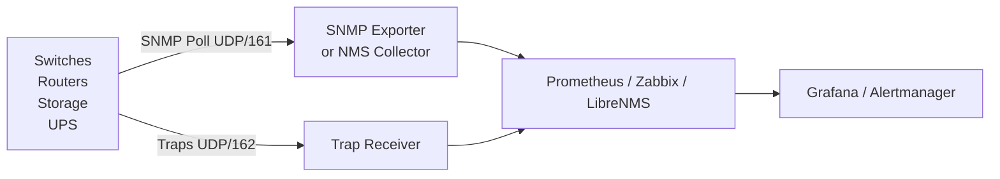

# SNMP in Monitoring


<div class="kb-summary">
SNMP is the primary protocol for collecting metrics from network devices, storage arrays, and infrastructure components that do not expose native Prometheus endpoints. This page covers integrating SNMP with the main monitoring platforms.
</div>

        SNMP MONITORING INTEGRATION
```text
┌───────────────────────────────────────────────────────────────┐
│  Infrastructure                                               │
│  ┌──────────┐ ┌──────────┐ ┌──────────┐ ┌──────────┐        │
│  │ Switches │ │ Routers  │ │ Storage  │ │   UPS    │        │
│  └────┬─────┘ └────┬─────┘ └────┬─────┘ └────┬─────┘        │
│       │ SNMP Poll  │ UDP/161     │             │              │
│       └────────────┴────────────┴─────────────┘              │
│                            │  UDP 162 TRAPs                   │
│             ┌──────────────▼──────────────────┐               │
│             │  SNMP Exporter / NMS Collector  │               │
│             │  (Prometheus snmp_exporter,     │               │
│             │   Zabbix proxy, LibreNMS)        │               │
│             └──────────────┬──────────────────┘               │
│                            │                                  │
│             ┌──────────────▼──────────────────┐               │
│             │  Prometheus / Zabbix / LibreNMS │               │
│             └──────────────┬──────────────────┘               │
│                            │                                  │
│             ┌──────────────▼──────────────────┐               │
│             │  Grafana dashboards + Alertmanager│              │
│             └─────────────────────────────────┘               │
└───────────────────────────────────────────────────────────────┘
```

## Architecture



## Prometheus + SNMP Exporter

```bash
# Install SNMP exporter
wget https://github.com/prometheus/snmp_exporter/releases/download/v0.26.0/snmp_exporter-0.26.0.linux-amd64.tar.gz
tar xzf snmp_exporter-*.tar.gz
install -m 755 snmp_exporter-*/snmp_exporter /usr/local/bin/

# Systemd unit
cat > /etc/systemd/system/snmp_exporter.service <<EOF
[Unit]
Description=Prometheus SNMP Exporter
After=network.target
[Service]
ExecStart=/usr/local/bin/snmp_exporter --config.file=/etc/snmp_exporter/snmp.yml
Restart=on-failure
[Install]
WantedBy=multi-user.target
EOF

systemctl daemon-reload
systemctl enable --now snmp_exporter
```

```yaml
# prometheus.yml — scrape SNMP targets
scrape_configs:
  - job_name: snmp_network
    static_configs:
      - targets:
          - 10.0.0.1   # switch
          - 10.0.0.2   # router
    metrics_path: /snmp
    params:
      module: [if_mib]
    relabel_configs:
      - source_labels: [__address__]
        target_label: __param_target
      - source_labels: [__param_target]
        target_label: instance
      - target_label: __address__
        replacement: localhost:9116   # SNMP exporter
```

## Zabbix SNMP Configuration

```bash
# Add SNMP host in Zabbix:
# Configuration → Hosts → Create host
# Interface: SNMP, IP: <device-ip>, Port: 161
# SNMP version: SNMPv3
# SNMP community / credentials: <configured above>

# Apply template:
# Templates: "Template Net Cisco IOS SNMPv2" or similar

# Verify:
# Monitoring → Latest data → filter by host → check ifOperStatus, CPU, memory
```

## LibreNMS SNMP Setup

```bash
# Add device
lnms device:add <device-ip> --community <community> --version v2c
# or SNMPv3:
lnms device:add <device-ip> --version v3 \
  --v3-username <user> --v3-authalgo SHA --v3-authpw <authpass> \
  --v3-cryptoalgo AES --v3-cryptopw <privpass>

# Poll immediately
lnms device:poll <device-ip>

# Check SNMP status in UI:
# Devices → <device> → Overview — if SNMP not responding, shows alert
```

## Trap Integration

### Zabbix — SNMP Trap Receiver

```bash
# /etc/zabbix/zabbix_server.conf
SNMPTrapperFile=/var/log/snmptrap/snmptrap.log
StartSNMPTrapper=1

# Configure snmptrapd to forward to Zabbix
# /etc/snmp/snmptrapd.conf
perl do "/usr/share/doc/zabbix-server-mysql/snmptrap.pl";
```

### Prometheus Alertmanager Trap Receiver

Use `snmp_notifier` or configure snmptrapd to write to a file that the node exporter's textfile collector reads.

## Key Metrics to Poll per Device Type

| Device | Key OIDs / MIBs |
|---|---|
| Network switch | IF-MIB (interfaces), EtherLike-MIB (errors), ENTITY-MIB (chassis) |
| Router | IF-MIB, IP-MIB (routing), BGP4-MIB |
| Linux server | HOST-RESOURCES-MIB, UCD-SNMP-MIB |
| UPS (APC) | PowerNet-MIB |
| Storage array | Vendor MIB (Pure, NetApp, Dell) |

## Common Issues

| Symptom | Cause | Check |
|---|---|---|
| SNMP exporter returns no metrics | Target unreachable or wrong module | `curl http://localhost:9116/snmp?target=<ip>&module=if_mib` |
| Zabbix item shows `Not supported` | OID not available on device | Verify OID with `snmpget` |
| High poll latency | Too many targets at short intervals | Increase scrape interval; use GETBULK |
| Trap not processed | Trap receiver not listening or community mismatch | `tcpdump -i any udp port 162` |
