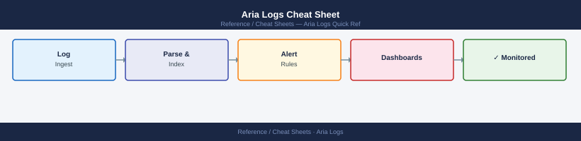

---
tags:
  - aria-logs
  - monitoring
---
# Aria Logs Cheat Sheet

<div class="kb-summary">
Top-10 Aria Logs (Log Insight) commands for agent control, syslog configuration, and log queries via CLI and REST API.
</div>


## Log Insight Agent (liagent)

```bash
# Linux agent control
systemctl status liagent                       # agent service status
systemctl restart liagent                      # restart agent
cat /var/log/liagent.log | tail -50            # recent agent log

# Agent config file: /etc/liagent.ini
# Key settings:
#   [server]
#   hostname = loginsight.lab.local
#   port = 9543
#   proto = cfapi
#   ssl = yes

/usr/lib/loginsight-agent/liagent -d            # debug mode (foreground, verbose)
```

## REST API

```bash
BASE="https://loginsight/api/v1"

# Authenticate
SESSION=$(curl -sk -X POST $BASE/sessions \
  -H "Content-Type: application/json" \
  -d '{"username":"admin","password":"VMware1!","provider":"Local"}' \
  | python3 -c "import sys,json; print(json.load(sys.stdin)['sessionId'])")
HDR="-H \"Authorization: Bearer $SESSION\""

# Queries
curl -sk $HDR "$BASE/events/text/CONTAINS+error?limit=100" | python3 -m json.tool

# Ingestion status
curl -sk $HDR "$BASE/cluster/vips" | python3 -m json.tool                # VIP config
curl -sk $HDR "$BASE/cluster" | python3 -m json.tool                     # cluster node health

# Alerts
curl -sk $HDR "$BASE/alerts" | python3 -m json.tool                      # configured alerts
```

## See also

- [Aria Logs Procedures](../../virtualization/vmware/aria-operations-for-logs/operations/procedures/)
- [Aria Logs Troubleshooting](../../virtualization/vmware/aria-operations-for-logs/troubleshooting/common-issues/)
