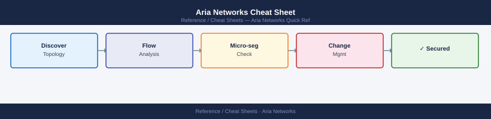

---
tags:
  - aria-networks
  - networking
---
# Aria Networks Cheat Sheet

*Applies to: All products*

<div class="kb-summary">
Top-10 Aria Networks (vRNI) REST API calls for network entity queries, path analysis, flow data, and event management.
</div>


## REST API

```bash
BASE="https://vrni/api/ni"

# Authenticate (get token)
TOKEN=$(curl -sk -X POST $BASE/auth/token \
  -H "Content-Type: application/json" \
  -d '{"username":"admin@local","password":"VMware1!","domain":{"domain_type":"LOCAL"}}' \
  | python3 -c "import sys,json; print(json.load(sys.stdin)['token'])")
HDR="-H \"Authorization: NetworkInsight $TOKEN\" -H \"Content-Type: application/json\""

# Entity queries
curl -sk $HDR "$BASE/entities/problems" | python3 -m json.tool             # active problems
curl -sk $HDR -X POST "$BASE/search" \
  -d '{"query":"vm where name = myvm"}' | python3 -m json.tool             # entity search

# Path analysis
curl -sk $HDR -X POST "$BASE/micro-seg/paths" \
  -d '{"source":{"entity":{"entity_id":"<src-id>"}},"destination":{"entity":{"entity_id":"<dst-id>"}}}' \
  | python3 -m json.tool

# Flows
curl -sk $HDR -X POST "$BASE/groups/flows" \
  -d '{"time_range":{"start_time":1700000000,"end_time":1700003600}}' \
  | python3 -m json.tool

# Data sources
curl -sk $HDR "$BASE/data-sources/vcenters" | python3 -m json.tool         # vCenter sources
curl -sk $HDR "$BASE/data-sources/nsxv-managers" | python3 -m json.tool    # NSX sources
```


```text title="Expected output"
{
  "problems": [
    {
      "id": "problem-42",
      "severity": "CRITICAL",
      "name": "Unprotected VM detected",
      "entity_id": "vm-156",
      "timestamp": 1700001234
    },
    {
      "id": "problem-41",
      "severity": "WARNING",
      "name": "Asymmetric flow detected",
      "entity_id": "flow-89",
      "timestamp": 1699998765
    }
  ],
  "total_count": 2
}
{
  "results": [
    {
      "entity_id": "vm-2048",
      "name": "myvm",
      "entity_type": "VirtualMachine",
      "ipv4_address": "192.168.1.105"
    }
  ]
}
{
  "paths": [
    {
      "path_id": "path-7821",
      "source_id": "vm-2048",
      "destination_id": "vm-3091",
      "allowed": true,
      "hops": 3
    }
  ]
}
{
  "flows": [
    {
      "flow_id": "flow-12847",
      "source_ip": "10.0.1.50",
      "destination_ip": "10.0.2.75",
      "protocol": "TCP",
      "port": 443,
      "packets": 1247
    },
    {
      "flow_id": "flow-12848",
      "source_ip": "10.0.1.51",
      "destination_ip": "10.0.3.100",
      "protocol": "TCP",
      "port": 22,
      "packets": 89
    }
  ]
}
{
  "vcenter_sources": [
    {
      "id": "ds-vc-001",
      "name": "prod-vcenter-01.corp.local",
      "status": "CONNECTED",
      "version": "7.0.3"
    }
  ]
}
{
  "nsxv_managers": [
    {
      "id": "ds-nsxv-001",
      "name": "nsx-manager-01.corp.local",
      "status": "CONNECTED",
      "version": "6.4.10"
    }
  ]
}
```

!!! warning "Common errors"
    **`curl: (60) SSL certificate problem: self signed certificate`** — Add `-k` flag to curl command to skip SSL verification, or import the vRNI certificate into your system trust store.
    **`jq: parse error: Cannot index string with string "token"`** — Ensure the authentication response is valid JSON and the password is correct; check vRNI logs if login fails silently.
    **`curl: (7) Failed to connect to vrni port 443: Connection refused`** — Verify the vRNI appliance is running and accessible at the BASE URL, and check network connectivity with `ping vrni` or `nc -zv vrni 443`.
## See also

- [Aria Networks Procedures](../../../virtualization/vmware/products/aria-operations-for-networks/operations/procedures/)
- [Aria Networks Troubleshooting](../../../virtualization/vmware/products/aria-operations-for-networks/troubleshooting/common-issues/)
