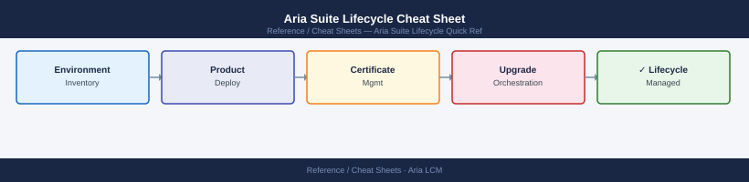

---
tags:
  - aria-suite-lifecycle
  - operations
---
# Aria Suite Lifecycle Cheat Sheet

<div class="kb-summary">
Top-10 Aria Suite Lifecycle (LCM) REST API calls for product installation, upgrades, locker management, and certificate operations.
</div>



```d2
direction: right

center: "Cheat Sheets" {shape: rectangle}
rest_api: "REST API" {shape: rectangle}

center -> rest_api
```

## REST API

```bash
BASE="https://lcm/lcm/api"
AUTH="-u admin@local:VMware1!"

# Environments
curl -sk $AUTH $BASE/v2/environments | python3 -m json.tool                # all environments
curl -sk $AUTH "$BASE/v2/environments/<env-id>" | python3 -m json.tool     # environment detail

# Products in an environment
curl -sk $AUTH "$BASE/v2/environments/<env-id>/products" | python3 -m json.tool

# Locker (credential store)
curl -sk $AUTH $BASE/v2/locker/passwords | python3 -m json.tool            # stored passwords
curl -sk $AUTH $BASE/v2/locker/certificates | python3 -m json.tool         # stored certs
curl -sk $AUTH $BASE/v2/locker/licenses | python3 -m json.tool             # stored licenses

# Certificates
curl -sk $AUTH -X POST $BASE/v2/locker/certificates/import \
  -H "Content-Type: application/json" \
  -d '{"alias":"my-cert","certificateChain":"-----BEGIN CERTIFICATE-----\n..."}' # import cert

# Upgrades
curl -sk $AUTH $BASE/v2/lcm/upgrades | python3 -m json.tool                # upgrade tasks
curl -sk $AUTH $BASE/v2/lcm/request/<req-id> | python3 -m json.tool        # request status

# Requests (track async ops)
curl -sk $AUTH $BASE/v2/requests | python3 -m json.tool                    # all recent requests
```

## See also

- [Aria Suite Lifecycle Procedures](../../virtualization/vmware/aria-suite-lifecycle/operations/procedures/)
- [Aria Suite Lifecycle Troubleshooting](../../virtualization/vmware/aria-suite-lifecycle/troubleshooting/common-issues/)
