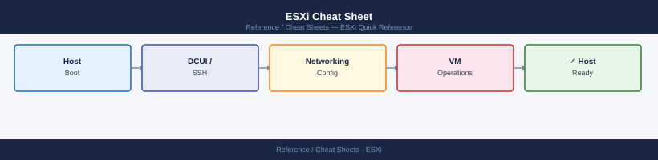

---
tags:
  - esxi
  - operations
description: "Top-10 ESXi shell commands for host management, networking, storage, and VM control via esxcli."
---
# ESXi Cheat Sheet

*Applies to: All products*

<div class="kb-summary">
Top-10 ESXi shell commands for host management, networking, storage, and VM control via <code>esxcli</code>.
</div>


## Common commands

```bash
# System info
esxcli system version get                      # ESXi build and version
esxcli system hostname get                     # FQDN and domain
esxcli hardware platform get                   # hardware vendor and model

# Network
esxcli network nic list                        # physical NICs: link state, speed, driver
esxcli network ip interface list               # VMkernel adapters and IPs
esxcli network vm list                         # VMs with active network connections

# Storage
esxcli storage nmp device list                 # NMP multipath devices
esxcli storage core adapter list               # HBAs: FC, iSCSI, NVMe
esxcli storage filesystem list                 # mounted datastores with capacity

# VMs
vim-cmd vmsvc/getallvms                        # all registered VMs with vmid
vim-cmd vmsvc/power.getstate <vmid>            # power state of a VM
vim-cmd vmsvc/power.on <vmid>                  # power on VM by vmid
vim-cmd vmsvc/snapshot.create <vmid> snap1     # create snapshot

# Maintenance
esxcli system maintenanceMode set --enable true   # enter maintenance mode
esxcli system maintenanceMode set --enable false  # exit maintenance mode
esxcli system shutdown poweroff --reason "hw fix" # power off host (with reason)
```


```text title="Expected output"
System Version: 7.0.3, Build 19193900
Hostname: esx-prod-01.datacenter.local
Domain Name: datacenter.local
Vendor Name: Dell Inc.
Model: PowerEdge R750

Name    Driver      Link State  Speed
vmnic0  ixgbe       Up          10000 Mbps
vmnic1  ixgbe       Up          10000 Mbps
vmnic2  bnx2x       Down        10000 Mbps

Name           IPAddress        Netmask          Broadcast        ArpSettings
vmk0           192.168.1.100    255.255.255.0    192.168.1.255    Enabled
vmk1           192.168.2.50     255.255.255.0    192.168.2.255    Enabled

World ID  Num Ports  Team Uplink  Active Filters  Config Port ID
2048      1          vmnic0       0               4200

Device                   State  Paths  Vendor   Model
naa.60060e80157d2700012d7d8c6d4e511  Active  4      NETAPP   LUN
naa.60060e80157d2700012d7d8c6d4e512  Active  2      EMC      LUN

Adapter  Type     Driver  State
vmhba0   FC       lpfc    link up
vmhba1   iSCSI    iscsi_vmk  link up
vmhba2   NVMe     nvme    link up

Mount Point  Volume Name        Capacity     Free Space
/vmfs/volumes/datastore1  ds-prod-ssd-01  2.0 TB  1.2 TB
/vmfs/volumes/datastore2  ds-prod-hdd-02  5.0 TB  2.8 TB

Vmid  Name                 File
1     prod-web-01          [datastore1] prod-web-01/prod-web-01.vmx
2     prod-db-02           [datastore2] prod-db-02/prod-db-02.vmx
3     prod-app-03          [datastore1] prod-app-03/prod-app-03.vmx

Retrieved runtime info for VM 1
Power State: poweredOn
(no output — command completes silently)
Snapshot created.

(no output — command completes silently)
(no output — command completes silently)
Shutting down the system. Reason: hw fix
```

!!! warning "Common errors"
    **`Error: The object or item referenced could not be found.`** — Verify the vmid exists by running `vim-cmd vmsvc/getallvms` and use the correct numeric ID.
    **`Error: Unable to change maintenance mode. Host has running virtual machines.`** — Migrate or power off all VMs before entering maintenance mode with `esxcli system maintenanceMode set --enable true`.
    **`Error: The ESXCLI command is not recognized.`** — Ensure you are connected to an ESXi host directly (not vCenter) and that the command syntax matches your ESXi version with `esxcli --version`.
## Quick diagnostics

```bash
esxcli system syslog config get                # syslog target and rotation config
esxcli network diag ping -H 8.8.8.8 -c 3      # ICMP ping from VMkernel
esxcli storage core device list | grep -i ssd # list SSD-flagged devices
esxtop -b -n 2 -d 2 > /tmp/esxtop.csv         # batch esxtop snapshot (2 iterations)
```


```text title="Expected output"
Syslog Configuration:
   Loghost: syslog.corp.local
   Loghost SSL Thumbprint: 
   Default Network Retry Timeout: 180
   Default Network Retry Attempts: 3
   Queue Drop Mark: 90
   Rotation Size: 1024
   Number of Rotations: 8

PING 8.8.8.8 (8.8.8.8): 56 data bytes
64 bytes from 8.8.8.8: icmp_seq=0 ttl=119 time=12.45 ms
64 bytes from 8.8.8.8: icmp_seq=1 ttl=119 time=11.89 ms
64 bytes from 8.8.8.8: icmp_seq=2 ttl=119 time=12.12 ms

--- 8.8.8.8 statistics ---
3 packets transmitted, 3 packets received, 0% packet loss
round-trip min/avg/max = 11.89/12.15/12.45 ms

Device Name                                VSANID  Display Name
mpx.vmhba2.C0:T0:L0                        N/A     SSD Samsung PM1735 3.2TB
mpx.vmhba3.C0:T1:L0                        N/A     SSD Intel Optane 1.5TB

Uptime: 45 days 3:22:15
PCPU USED(%): 8.45  RUN(%): 2.12  OVRLP(%): 0.00  LATCY(us): 145
MEMORY STATS (MB): 262144 TOTAL, 198456 VMKERNL, 45678 OTHER, 18010 FREE
```

!!! warning "Common errors"
    **`Error: Unable to connect to syslog server syslog.corp.local`** — Verify the syslog server hostname/IP is reachable and the firewall allows UDP 514 from the ESXi host.
    **`Connect timed out`** — Check network connectivity to 8.8.8.8 and ensure the VMkernel management network route is configured correctly.
    **`/tmp/esxtop.csv: Permission denied`** — Run the command with elevated privileges or redirect output to a writable directory like /var/tmp instead.
## See also

- [ESXi Operations](../../../virtualization/vmware/products/esxi/operations/procedures/)
- [ESXi Troubleshooting](../../../virtualization/vmware/products/esxi/troubleshooting/common-issues/)
- [PowerCLI Cheat Sheet](../powercli/)
