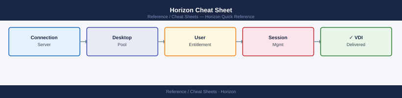

---
tags:
  - horizon
  - operations
---
# Horizon Cheat Sheet

<div class="kb-summary">
Top-10 Horizon commands for desktop pool management, agent control, and session operations via <code>vdmadmin</code> and PowerShell.
</div>



## vdmadmin (Connection Server command line)

```bash
# Run on Connection Server as Administrator
vdmadmin -L                                    # list all pools and desktops
vdmadmin -S -pool_id mypool                    # summary of pool mypool
vdmadmin -N -pools                             # entitlements (user→pool mappings)

# Session control
vdmadmin -O -u domain\\username               # log off all sessions for user
vdmadmin -D -desktop desktop01 -u domain\\user # unassign dedicated desktop

# Agent and machine ops
vdmadmin -A -dns desktop01.lab.local          # machine detail (state, pool, user)
vdmadmin -M -machine desktop01 -remove        # remove machine from inventory
```

## PowerShell (VMware.Hv.Helper module)

```powershell
Import-Module VMware.Hv.Helper
Connect-HVServer -Server cs.lab.local -User admin -Password VMware1!

# Pools and desktops
Get-HVPool                                     # list all desktop and app pools
Get-HVMachine -PoolName mypool                 # machines in a pool
Get-HVLocalSession                             # active sessions on this CS

# Machine lifecycle
Reset-HVMachine -MachineName desktop01         # reboot machine
Remove-HVMachine -MachineName desktop01        # delete machine from pool
Add-HVMachine -PoolName mypool -MachineCount 5 # add machines to pool
```

## See also

- [Horizon Operations](../../virtualization/vmware/horizon/operations/procedures/)
- [Horizon Troubleshooting](../../virtualization/vmware/horizon/troubleshooting/common-issues/)
