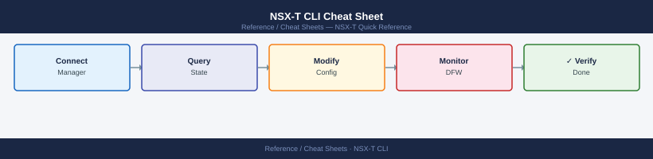

---
tags:
  - nsx
  - nsx-t
  - networking
  - cli-reference
---
# NSX-T CLI Cheat Sheet

<div class="kb-summary">
Essential NSX-T CLI commands for NSX Manager, transport nodes, logical networking, Distributed Firewall, and Edge node operations — plus curl REST API examples for key queries.
</div>



```d2
direction: right

center: "Cheat Sheets" {shape: rectangle}
nsx_manager_cli_ssh_to_nsx_manager: "NSX Manager CLI (SSH to NSX Manager)" {shape: rectangle}
transport_nodes: "Transport Nodes" {shape: rectangle}
logical_networking: "Logical Networking" {shape: rectangle}
distributed_firewall: "Distributed Firewall" {shape: rectangle}
rest_api_examples_curl: "REST API Examples (curl)" {shape: rectangle}
edge_node: "Edge Node" {shape: rectangle}

center -> nsx_manager_cli_ssh_to_nsx_manager
center -> transport_nodes
center -> logical_networking
center -> distributed_firewall
center -> rest_api_examples_curl
center -> edge_node
```

## NSX Manager CLI (SSH to NSX Manager)

| Command | Description | Example |
|---|---|---|
| `get managers` | List NSX Manager cluster members and state | `get managers` |
| `get certificate api` | Show the API certificate thumbprint | `get certificate api` |
| `get cluster config` | Display cluster configuration | `get cluster config` |
| `get controller` | Show controller service status | `get controller` |
| `get services` | List all running services and their status | `get services` |

## Transport Nodes

| Command | Description | Example |
|---|---|---|
| `get transport-nodes` | List all transport nodes and state | `get transport-nodes` |
| `get host-switch-profiles` | Show host switch profile assignments | `get host-switch-profiles` |
| `get fabric-nodes` | List all fabric (compute) nodes | `get fabric-nodes` |

## Logical Networking

| Command | Description | Example |
|---|---|---|
| `get logical-switches` | List all logical switches | `get logical-switches` |
| `get logical-routers` | List all logical routers (T0/T1) | `get logical-routers` |
| `get logical-router ports` | Show ports for all logical routers | `get logical-router ports` |

## Distributed Firewall

| Command | Description | Example |
|---|---|---|
| `get firewall stats` | Show DFW statistics | `get firewall stats` |
| `get firewall rules` | List DFW rules on this node | `get firewall rules` |
| `get security-groups` | List security group membership | `get security-groups` |

## REST API Examples (curl)

```bash
BASE="https://nsx-mgr"
AUTH="-u admin:VMware1!"

# List transport zones
curl -sk $AUTH $BASE/api/v1/transport-zones | python3 -m json.tool

# List segments (Policy API)
curl -sk $AUTH $BASE/policy/api/v1/infra/segments | python3 -m json.tool

# Get DFW rule count
curl -sk $AUTH $BASE/policy/api/v1/infra/domains/default/security-policies \
  | python3 -c "import sys,json; d=json.load(sys.stdin); print('Policies:', d['result_count'])"
```

## Edge Node

| Command | Description | Example |
|---|---|---|
| `get uplinks` | Show Edge uplink interface status | `get uplinks` |
| `get arp table` | Display the ARP table on this Edge | `get arp table` |
| `get route table` | Show the routing table | `get route table` |
| `get bgp neighbor` | List BGP neighbors and session state | `get bgp neighbor` |

## See Also

- [NSX-T Operations](../../virtualization/vmware/nsx/operations/procedures/)
- [NSX-T Health Checks](../../virtualization/vmware/nsx/operations/health-checks/)
- [NSX-T Troubleshooting](../../virtualization/vmware/nsx/troubleshooting/common-issues/)
