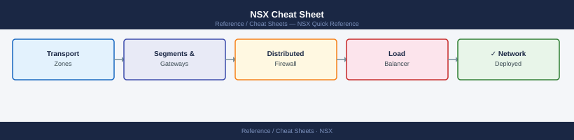

---
tags:
  - nsx
  - networking
---
# NSX Cheat Sheet

<div class="kb-summary">
Top-10 NSX commands for transport nodes, segments, T0/T1 gateways, and DFW via the NSX Manager CLI and REST API.
</div>



```d2
direction: right

center: "Cheat Sheets" {shape: rectangle}
nsx_manager_cli_ssh_to_nsx_manager: "NSX Manager CLI (SSH to NSX Manager)" {shape: rectangle}
rest_api_curl_examples: "REST API (curl examples)" {shape: rectangle}

center -> nsx_manager_cli_ssh_to_nsx_manager
center -> rest_api_curl_examples
```

## NSX Manager CLI (SSH to NSX Manager)

```bash
get version                                    # NSX version and build
get cluster status                             # cluster node health
get transport-nodes                            # all transport nodes and state
get logical-switch                             # list all logical switches (MP API)
get bgp neighbor                               # BGP peer state on Edge nodes
get interface                                  # interfaces on Edge/Manager
get certificate cluster                        # cluster certificate thumbprint
```

## REST API (curl examples)

```bash
BASE="https://nsx-mgr"
AUTH="-u admin:VMware1!"

# Transport nodes
curl -sk $AUTH $BASE/api/v1/transport-nodes | python3 -m json.tool

# Segments (Policy API)
curl -sk $AUTH $BASE/policy/api/v1/infra/segments | python3 -m json.tool

# T0 gateways
curl -sk $AUTH $BASE/policy/api/v1/infra/tier-0s | python3 -m json.tool

# Firewall rules (DFW)
curl -sk $AUTH $BASE/policy/api/v1/infra/domains/default/security-policies | python3 -m json.tool

# BGP route table on Edge
curl -sk $AUTH "$BASE/api/v1/logical-routers/<lr-id>/routing/bgp/neighbors" | python3 -m json.tool
```

## See also

- [NSX Operations](../../virtualization/vmware/nsx/operations/procedures/)
- [NSX Troubleshooting](../../virtualization/vmware/nsx/troubleshooting/common-issues/)
- [NSX Health Checks](../../virtualization/vmware/nsx/operations/health-checks/)
