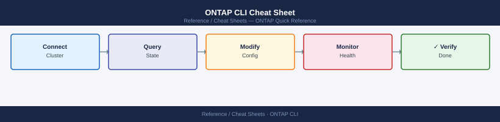

---
tags:
  - netapp
  - ontap
  - cli-reference
  - storage
---
# ONTAP CLI Cheat Sheet

*Applies to: All products*

Essential ONTAP CLI commands for cluster, SVM, volume, aggregate, network, SnapMirror, protocol, and health operations — one-line references for day-to-day storage administration.

## Cluster & Node

| Command | Description | Example |
|---|---|---|
| `cluster show` | List all cluster nodes and health | `cluster show` |
| `system node show` | Detailed node info (model, uptime, state) | `system node show -node *` |
| `system health status show` | Overall system health summary | `system health status show` |
| `cluster ping-cluster` | Ping all cluster interconnect paths | `cluster ping-cluster -node node1` |

## SVM Management

| Command | Description | Example |
|---|---|---|
| `vserver show` | List all SVMs and their state | `vserver show` |
| `vserver create` | Create a new SVM | `vserver create -vserver svm1 -rootvolume svm1_root -rootvolume-security-style unix` |
| `vserver modify` | Modify SVM properties | `vserver modify -vserver svm1 -language en_US` |

## Volume Operations

| Command | Description | Example |
|---|---|---|
| `volume show` | List volumes on the cluster | `volume show -vserver svm1` |
| `volume create` | Create a new volume | `volume create -vserver svm1 -volume vol1 -aggregate aggr1 -size 100g` |
| `volume modify -space-guarantee none` | Set thin provisioning on a volume | `volume modify -vserver svm1 -volume vol1 -space-guarantee none` |
| `volume mount` | Mount a volume at a junction path | `volume mount -vserver svm1 -volume vol1 -junction-path /vol1` |
| `volume unmount` | Unmount a volume | `volume unmount -vserver svm1 -volume vol1` |
| `volume snapshot create` | Take a manual snapshot | `volume snapshot create -vserver svm1 -volume vol1 -snapshot snap1` |
| `volume snapshot restore` | Restore a volume from snapshot | `volume snapshot restore -vserver svm1 -volume vol1 -snapshot snap1` |

## Aggregate & RAID

| Command | Description | Example |
|---|---|---|
| `storage aggregate show` | List aggregates and their state | `storage aggregate show` |
| `storage aggregate show-space` | Show aggregate capacity usage | `storage aggregate show-space -aggregate aggr1` |
| `disk show` | List all disks and their assignment | `disk show -container-type spare` |

## Network

| Command | Description | Example |
|---|---|---|
| `network interface show` | List all LIFs | `network interface show -vserver svm1` |
| `network interface create` | Create a new LIF | `network interface create -vserver svm1 -lif lif1 -role data -data-protocol nfs -home-node node1 -home-port e0a -address 10.0.0.10 -netmask 255.255.255.0` |
| `network port show` | List all network ports | `network port show -node node1` |
| `network route show` | Show routing table entries | `network route show -vserver svm1` |

## SnapMirror

| Command | Description | Example |
|---|---|---|
| `snapmirror show` | List all SnapMirror relationships | `snapmirror show` |
| `snapmirror initialize` | Initialize a SnapMirror relationship | `snapmirror initialize -destination-path svm2:vol1` |
| `snapmirror update` | Trigger an on-demand SnapMirror update | `snapmirror update -destination-path svm2:vol1` |
| `snapmirror break` | Break a SnapMirror relationship (failover) | `snapmirror break -destination-path svm2:vol1` |
| `snapmirror resync` | Resync after a break | `snapmirror resync -destination-path svm2:vol1` |
| `snapmirror delete` | Delete a SnapMirror relationship | `snapmirror delete -destination-path svm2:vol1` |

## NFS / iSCSI / FC

| Command | Description | Example |
|---|---|---|
| `vserver nfs show` | Show NFS configuration per SVM | `vserver nfs show -vserver svm1` |
| `iscsi show` | Show iSCSI service status | `iscsi show -vserver svm1` |
| `fcp show` | Show FC protocol status | `fcp show -vserver svm1` |
| `lun show` | List LUNs on the cluster | `lun show -vserver svm1` |
| `lun map show` | Show LUN-to-initiator-group mappings | `lun map show -vserver svm1` |

## Health & Support

| Command | Description | Example |
|---|---|---|
| `system health alert show` | Show active health alerts | `system health alert show` |
| `event log show` | Display the EMS event log | `event log show -severity ERROR -time-range 1h` |
| `autosupport invoke` | Trigger an AutoSupport message | `autosupport invoke -node * -type all -message "test"` |

## See Also

- [NetApp ONTAP Operations](../../../storage/products/netapp/ontap/operations/procedures/)
- [NetApp ONTAP Health Checks](../../../storage/products/netapp/ontap/operations/health-checks/)
- [NetApp ONTAP Troubleshooting](../../../storage/products/netapp/ontap/troubleshooting/common-issues/)
