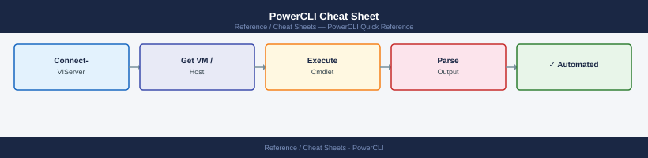

---
tags:
  - vcenter
  - automation
description: "Top-10 PowerCLI one-liners for VM, host, storage, network, and cluster operations across vSphere environments."
---
# PowerCLI Cheat Sheet

*Applies to: All products*

<div class="kb-summary">
Top-10 PowerCLI one-liners for VM, host, storage, network, and cluster operations across vSphere environments.
</div>


## Connection and session

```powershell
Set-PowerCLIConfiguration -InvalidCertificateAction Ignore -Confirm:$false  # suppress TLS warnings
Connect-VIServer -Server vcenter.lab.local -User admin -Password VMware1!
Disconnect-VIServer -Server * -Confirm:$false                                # disconnect all
$global:DefaultVIServer                                                       # current connection
```

## VMs

```powershell
Get-VM                                                                        # all VMs
Get-VM -Name "web*"                                                           # wildcard filter
Get-VM | Where { $_.PowerState -eq "PoweredOff" }                            # powered-off VMs
Start-VM -VM (Get-VM "myvm")                                                  # power on
Stop-VMGuest -VM (Get-VM "myvm") -Confirm:$false                             # graceful shutdown
Get-VM | Select Name,PowerState,NumCpu,MemoryGB | Export-Csv vms.csv         # export inventory
```

## Hosts and clusters

```powershell
Get-VMHost                                                                    # all hosts
Get-VMHost | Where { $_.ConnectionState -eq "Connected" }                    # connected hosts
Get-Cluster                                                                   # all clusters
Get-VMHost -Location (Get-Cluster "prod-cluster")                            # hosts in cluster
Set-VMHost -VMHost (Get-VMHost "esx01") -State Maintenance                   # maintenance mode
```

## Storage and snapshots

```powershell
Get-Datastore                                                                 # all datastores
Get-Datastore | Select Name,FreeSpaceGB,CapacityGB | Sort FreeSpaceGB        # sort by free space
Get-VM | Get-Snapshot                                                         # all snapshots
Get-VM | Get-Snapshot | Where { $_.Created -lt (Get-Date).AddDays(-7) }     # snapshots >7 days
Get-VM | Get-Snapshot | Remove-Snapshot -Confirm:$false                      # delete all snapshots
```

## Networks

```powershell
Get-VirtualSwitch                                                             # all vSwitches
Get-VDSwitch                                                                  # all distributed switches
Get-VirtualPortGroup                                                          # all port groups
Get-VM | Get-NetworkAdapter | Select VM,NetworkName,MacAddress                # VM NIC inventory
```

## See also

- [ESXi Cheat Sheet](../esxi/)
- [vCenter Cheat Sheet](../vcenter/)
- [vSAN Cheat Sheet](../vsan/)
