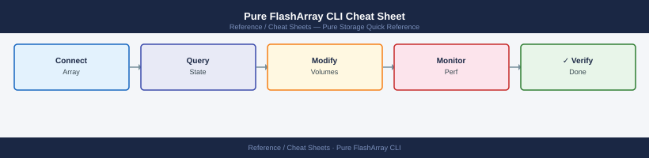

---
tags:
  - pure-storage
  - flasharray
  - cli-reference
  - storage
---
# Pure Storage FlashArray CLI Cheat Sheet

Essential Pure Storage FlashArray CLI commands for array status, volume management, snapshots, host connections, protection groups, performance monitoring, and network configuration.

## Array Status

| Command | Description | Example |
|---|---|---|
| `purearray list` | Show array name, model, and version | `purearray list` |
| `purearray info` | Detailed array info including capacity | `purearray info` |
| `puredrive list` | List all drives and their status | `puredrive list` |
| `purehw list` | List hardware components and health | `purehw list` |

## Volumes

| Command | Description | Example |
|---|---|---|
| `purevol list` | List all volumes and capacity | `purevol list` |
| `purevol create` | Create a new volume | `purevol create vol1 --size 1T` |
| `purevol copy` | Copy (clone) a volume | `purevol copy vol1 vol1-clone` |
| `purevol destroy` | Destroy a volume (moves to eradication pending) | `purevol destroy vol1` |
| `purevol eradicate` | Permanently eradicate a destroyed volume | `purevol eradicate vol1` |

## Snapshots

| Command | Description | Example |
|---|---|---|
| `puresnap list` | List all snapshots | `puresnap list` |
| `puresnap create` | Create a snapshot of a volume | `puresnap create vol1 --suffix snap1` |
| `puresnap copy` | Copy a snapshot to a new volume | `puresnap copy vol1.snap1 vol1-restored` |
| `puresnap destroy` | Destroy a snapshot | `puresnap destroy vol1.snap1` |

## Hosts & Connections

| Command | Description | Example |
|---|---|---|
| `purehost list` | List all hosts and their WWNs/IQNs | `purehost list` |
| `purehost create` | Create a host definition | `purehost create host1 --wwn 21:00:00:24:ff:ab:cd:ef` |
| `purehostgroup list` | List all host groups | `purehostgroup list` |
| `purehost connect` | Connect a volume to a host | `purehost connect --vol vol1 host1` |
| `purehost disconnect` | Disconnect a volume from a host | `purehost disconnect --vol vol1 host1` |

## Protection Groups

| Command | Description | Example |
|---|---|---|
| `purepgroup list` | List all protection groups | `purepgroup list` |
| `purepgroup create` | Create a new protection group | `purepgroup create pg1` |
| `purepgroup snap` | Take a protection group snapshot | `purepgroup snap --snap pg1` |
| `purepgroup setschedule` | Set snapshot schedule for a pgroup | `purepgroup setschedule pg1 --snap-enabled true --snap-frequency 3600` |

## Performance

| Command | Description | Example |
|---|---|---|
| `purevolperf list` | Show per-volume IOPS, bandwidth, latency | `purevolperf list` |
| `purearrayperf list` | Show array-wide performance metrics | `purearrayperf list` |

## Network

| Command | Description | Example |
|---|---|---|
| `purenetwork list` | List all network interfaces | `purenetwork list` |
| `purenetwork interface list` | Show interface details including IP | `purenetwork interface list` |
| `purenetwork subnet list` | List configured subnets | `purenetwork subnet list` |

## See Also

- [Pure Storage FlashArray Operations](../../storage/pure-storage/flasharray/operations/procedures/)
- [Pure Storage FlashArray Health Checks](../../storage/pure-storage/flasharray/operations/health-checks/)
- [Pure Storage FlashArray Troubleshooting](../../storage/pure-storage/flasharray/troubleshooting/common-issues/)
