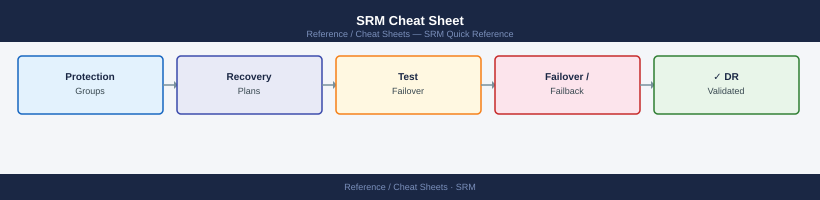

---
tags:
  - srm
  - backup-dr
description: "Top-10 SRM commands for protection groups, recovery plans, test failover, and failover operations via PowerCLI and REST API."
---
# SRM Cheat Sheet

*Applies to: All products*

<div class="kb-summary">
Top-10 SRM commands for protection groups, recovery plans, test failover, and failover operations via PowerCLI and REST API.
</div>


## PowerCLI

```powershell
Import-Module VMware.VimAutomation.Srm
$srm = Connect-SrmServer -Server srm.lab.local -User admin -Password VMware1!

# Protection groups
$pg = $srm.ExtensionData.Protection.ListProtectionGroups()
$pg | Select Name, State, ProtectionState                                  # group list + state

# Recovery plans
$rp = $srm.ExtensionData.Recovery.ListPlans()
$rp | Select Name, State                                                   # plan list + state

# Test failover
$plan = ($rp | Where { $_.Name -eq "MyPlan" }).MoRef
$srm.ExtensionData.Recovery.Start($plan, @{RunMode="test"})               # start test

# Cleanup test failover
$srm.ExtensionData.Recovery.Start($plan, @{RunMode="cleanupTest"})        # cleanup

# Real failover (planned migration)
$srm.ExtensionData.Recovery.Start($plan, @{RunMode="migration"})          # planned failover

# Reprotect
$srm.ExtensionData.Recovery.Reprotect($plan)                              # reverse protection
```

## REST API

```bash
BASE="https://srm/api"
AUTH="-u admin:VMware1!"

curl -sk $AUTH $BASE/pairing | python3 -m json.tool                        # site pairing info
curl -sk $AUTH $BASE/plans | python3 -m json.tool                          # all recovery plans
curl -sk $AUTH $BASE/plans/<id>/history | python3 -m json.tool             # plan run history
```


```text title="Expected output"
{
  "pairing": {
    "site_id": "site-1a2b3c4d",
    "site_name": "Production-DC",
    "paired_site_id": "site-5e6f7g8h",
    "paired_site_name": "DR-DC",
    "pairing_status": "PAIRED",
    "last_sync": "2024-01-15T14:32:18Z"
  }
}
{
  "plans": [
    {
      "id": "plan-001",
      "name": "Critical-Apps",
      "status": "READY",
      "last_run": "2024-01-14T09:15:00Z"
    },
    {
      "id": "plan-002",
      "name": "Database-Tier",
      "status": "READY",
      "last_run": "2024-01-13T22:45:00Z"
    }
  ]
}
{
  "history": [
    {
      "run_id": "run-20240115-001",
      "timestamp": "2024-01-15T14:32:18Z",
      "status": "SUCCESS",
      "duration_seconds": 1847
    },
    {
      "run_id": "run-20240114-001",
      "timestamp": "2024-01-14T09:15:00Z",
      "status": "SUCCESS",
      "duration_seconds": 2103
    }
  ]
}
```

!!! warning "Common errors"
    **`curl: (60) SSL certificate problem: self signed certificate`** — Add `-k` flag to skip SSL verification (already present in example, but ensure it's not removed).
    **`curl: (7) Failed to connect to srm: Name or service not known`** — Verify the SRM hostname/IP in the BASE variable and ensure network connectivity to the SRM appliance.
    **`jq: parse error: Invalid JSON`** — Ensure the API endpoint is correct and the SRM service is running; check response with `curl -sk $AUTH $BASE/pairing` without piping to json.tool first.
## See also

- [SRM Operations](../../../virtualization/vmware/products/srm/operations/procedures/)
- [SRM Troubleshooting](../../../virtualization/vmware/products/srm/troubleshooting/common-issues/)
