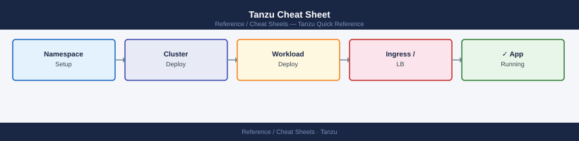

---
tags:
  - tanzu
  - kubernetes
---
# Tanzu Cheat Sheet

<div class="kb-summary">
Top-10 Tanzu commands for cluster lifecycle, package management, and Kubernetes operations in TKG environments.
</div>


## Tanzu CLI

```bash
tanzu version                                          # CLI and plugin versions
tanzu plugin list                                      # installed plugins and status
tanzu management-cluster get                           # management cluster status
tanzu cluster list --include-management-cluster        # all clusters

# Cluster lifecycle
tanzu cluster create my-cluster -f cluster.yaml        # create workload cluster
tanzu cluster delete my-cluster                        # delete workload cluster
tanzu cluster scale my-cluster --worker-machine-count 5   # scale workers

# Packages
tanzu package repository list -A                       # package repositories
tanzu package available list -A                        # available packages
tanzu package installed list -A                        # installed packages
tanzu package install cert-manager \
  --package-name cert-manager.tanzu.vmware.com \
  --version 1.7.2+vmware.1 -n tkg-packages            # install a package
```


```text title="Expected output"
version: v1.6.0
buildNumber: 6e2d8c9a
details:
  cliVersion: v1.6.0
  edition: open-source

NAME                    DESCRIPTION                   SCOPE       STATUS
management-cluster      Kubernetes cluster management  Kubernetes  installed
package-plugin          Package management            Kubernetes  installed
secret-plugin           Secret management             Kubernetes  installed

  NAME                 NAMESPACE                STATUS   ROLES
  tkg-mgmt-prod        tkg-system               running  management
  
  NAME                 NAMESPACE                STATUS   ROLES
  tkg-mgmt-prod        tkg-system               running  management
  my-workload-01       default                  running  <none>
  my-workload-02       default                  running  <none>

REPOSITORY                                    NAMESPACE      STATUS
tanzu-standard                                tkg-packages   Reconcile succeeded
community-packages                            tkg-packages   Reconcile succeeded

PACKAGE-NAME                                  PACKAGE-VERSION
cert-manager.tanzu.vmware.com                 1.7.2+vmware.1
contour.tanzu.vmware.com                      1.20.2+vmware.1
external-dns.tanzu.vmware.com                 0.11.0+vmware.1
...

PACKAGE-NAME                                  PACKAGE-VERSION  NAMESPACE
cert-manager.tanzu.vmware.com                 1.7.2+vmware.1   tkg-packages
contour.tanzu.vmware.com                      1.20.2+vmware.1  tanzu-system

Installing package 'cert-manager'
Getting package metadata for cert-manager.tanzu.vmware.com
Creating service account for cert-manager
Waiting for package reconciliation
Package installed successfully in namespace 'tkg-packages'
```

!!! warning "Common errors"
    **`Error: management cluster not found`** — Ensure your kubeconfig is set to the management cluster context with `kubectl config use-context`.
    **`Error: package 'cert-manager.tanzu.vmware.com' not found in repository`** — Verify the package repository is synced with `tanzu package repository list -A` and the version exists in `tanzu package available list -A`.
    **`Error: failed to create cluster: invalid cluster configuration`** — Validate the cluster.yaml file syntax and required fields (name, controlPlaneCount, workerMachineCount) match your infrastructure provider.
## TKGs (vSphere with Tanzu — Supervisor kubeconfig)

```bash
# Login to Supervisor (TKGs)
kubectl vsphere login --server <supervisor-ip> --vsphere-username admin@vsphere.local

# Namespace and cluster ops
kubectl get ns                                         # namespaces (vSphere namespaces)
kubectl get tkc -n my-ns                               # TanzuKubernetesCluster objects
```


```text title="Expected output"
Logged in successfully to supervisor cluster at 192.168.1.100
You have access to the following contexts:
   192.168.1.100

The current context is now "192.168.1.100".

NAME                                   STATUS   AGE
my-ns                                  Active   45d
kube-system                            Active   89d
kube-public                            Active   89d
vmware-system-auth                     Active   89d
kube-node-lease                        Active   89d

NAME                      STATUS   READY   SEVERITY   AGE
prod-cluster-01           Ready    3/3     Normal     32d
dev-cluster-02            Ready    1/1     Normal     8d
staging-cluster-03        Ready    2/2     Normal     15d
```

!!! warning "Common errors"
    **`error: Unable to connect to 192.168.1.100:6443: dial tcp: lookup supervisor-ip: no such host`** — Replace `<supervisor-ip>` with the actual Supervisor cluster IP address or FQDN.
    **`error: invalid credentials provided`** — Verify the vSphere username and password are correct, and that the account has Supervisor cluster access permissions.
    **`error: the server doesn't have a resource type "tkc"`** — Ensure you are logged into the Supervisor cluster context (not a guest cluster), as TanzuKubernetesCluster objects only exist on the Supervisor.
## See also

- [Tanzu Operations](../../../virtualization/vmware/tanzu/operations/procedures/)
- [Tanzu Troubleshooting](../../../virtualization/vmware/tanzu/troubleshooting/common-issues/)
