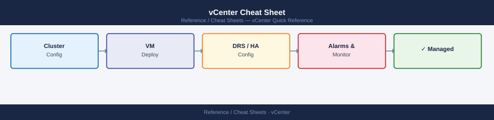

---
tags:
  - vcenter
  - operations
---
# vCenter Cheat Sheet

<div class="kb-summary">
Top-10 vCenter commands for appliance management, inventory queries, and service control via <code>govc</code> and <code>dcli</code>.
</div>


## Common commands

```bash
# Connection (set once per session)
export GOVC_URL=https://vcenter.lab.local
export GOVC_USERNAME=administrator@vsphere.local
export GOVC_PASSWORD=VMware1!
export GOVC_INSECURE=true                      # skip TLS verify in lab

# Inventory
govc about                                     # vCenter version and build
govc ls /DC/host                               # list clusters and hosts
govc ls /DC/vm                                 # list all VMs
govc find / -type d                            # all datacenters and folders

# VMs
govc vm.info /DC/vm/my-vm                      # power state, CPU, mem, IPs
govc vm.power -on /DC/vm/my-vm                 # power on
govc vm.power -off -force /DC/vm/my-vm         # force power off
govc vm.clone -vm /DC/vm/template /DC/vm/clone # clone from template

# Hosts and clusters
govc host.info /DC/host/cluster/esx01          # host summary (CPU, mem, version)
govc cluster.usage /DC/host/cluster            # cluster capacity and usage

# Datastores
govc datastore.info /DC/datastore/vsanDS       # type, capacity, free
govc datastore.ls /DC/datastore/vsanDS         # list files on datastore
```

## Appliance (VCSA shell)

```bash
# Run on VCSA via SSH
service-control --status                       # all VCSA service states
service-control --start vpxd                   # start vCenter service
vmon-cli -l                                    # list all services with health
dcli com vmware cis tagging tag list           # list all tags via dcli
```

## See also

- [vCenter Operations](../../../virtualization/vmware/vcenter/operations/procedures/)
- [vCenter Troubleshooting](../../../virtualization/vmware/vcenter/troubleshooting/common-issues/)
- [PowerCLI Cheat Sheet](../powercli/)
