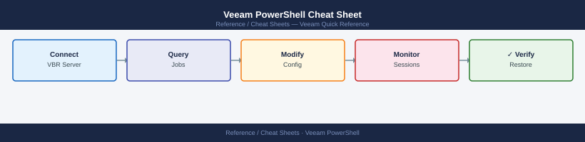

---
tags:
  - veeam
  - powershell
  - backup
  - cli-reference
description: "Essential Veeam Backup &amp; Replication PowerShell cmdlets for server connection, job management, repository operations, restores, backup copy, tape, and..."
---
# Veeam PowerShell Cheat Sheet

*Applies to: All products*

Essential Veeam Backup &amp; Replication PowerShell cmdlets for server connection, job management, repository operations, restores, backup copy, tape, and reporting.

## Connect & Setup

| Command | Description | Example |
|---|---|---|
| `Connect-VBRServer` | Connect to a Veeam Backup & Replication server | `Connect-VBRServer -Server vbr01 -Credential (Get-Credential)` |
| `Disconnect-VBRServer` | Disconnect the current VBR session | `Disconnect-VBRServer` |
| `Get-VBRServerSession` | Show the current server session details | `Get-VBRServerSession` |

## Jobs

| Command | Description | Example |
|---|---|---|
| `Get-VBRJob` | List all backup jobs | `Get-VBRJob` |
| `Start-VBRJob` | Start a backup job immediately | `Start-VBRJob -Job (Get-VBRJob -Name "Daily Backup")` |
| `Stop-VBRJob` | Stop a running backup job | `Stop-VBRJob -Job (Get-VBRJob -Name "Daily Backup")` |
| `Get-VBRJobSession` | List sessions for a job | `Get-VBRJobSession -Job (Get-VBRJob -Name "Daily Backup")` |
| `Get-VBRTaskSession` | Get task-level detail for a job session | `Get-VBRJobSession -Last | Get-VBRTaskSession` |

## Backup Repositories

| Command | Description | Example |
|---|---|---|
| `Get-VBRBackupRepository` | List all configured backup repositories | `Get-VBRBackupRepository` |
| `Add-VBRBackupRepository` | Add a new backup repository | `Add-VBRBackupRepository -Name "Repo1" -Server $srv -Folder "D:\Backups" -Type WinLocal` |

## Restore

| Command | Description | Example |
|---|---|---|
| `Get-VBRRestorePoint` | List available restore points | `Get-VBRRestorePoint -Name "vm01"` |
| `Start-VBRRestoreVM` | Start a full VM restore | `Start-VBRRestoreVM -RestorePoint $rp -ToOriginalLocation` |
| `Stop-VBRRestoreVM` | Stop an in-progress VM restore | `Stop-VBRRestoreVM -Session $session` |
| `Get-VBRViInstantRecovery` | List active Instant Recovery sessions | `Get-VBRViInstantRecovery` |

## Backup Copy

| Command | Description | Example |
|---|---|---|
| `Get-VBRBackupCopyJob` | List all backup copy jobs | `Get-VBRBackupCopyJob` |
| `Start-VBRBackupCopyJob` | Start a backup copy job immediately | `Start-VBRBackupCopyJob -Job (Get-VBRBackupCopyJob -Name "Offsite Copy")` |

## Tape

| Command | Description | Example |
|---|---|---|
| `Get-VBRTapeJob` | List all tape backup jobs | `Get-VBRTapeJob` |
| `Get-VBRTapeMedium` | List tape media and status | `Get-VBRTapeMedium` |

## Reporting

| Command | Description | Example |
|---|---|---|
| `Get-VBRBackup` | List all backups on repositories | `Get-VBRBackup` |
| `Get-VBRComputerBackup` | List agent-based (physical) backups | `Get-VBRComputerBackup` |

## See Also

- [Veeam Operations](../../../backup/products/veeam/operations/procedures/)
- [Veeam Health Checks](../../../backup/products/veeam/operations/health-checks/)
- [Veeam Troubleshooting](../../../backup/products/veeam/troubleshooting/common-issues/)
