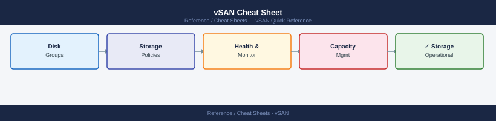

---
tags:
  - vsan
  - storage
---
# vSAN Cheat Sheet

<div class="kb-summary">
Top-10 vSAN commands for cluster health, disk groups, object status, and policy via <code>esxcli vsan</code> and PowerCLI.
</div>



## Common commands

```bash
# Cluster state (run on any ESXi host in cluster)
esxcli vsan cluster get                        # cluster UUID, node count, health
esxcli vsan cluster unicastagent list          # unicast peers for this host
esxcli vsan network list                       # VMkernel adapter used for vSAN

# Disk groups
esxcli vsan storage list                       # all disks: cache/capacity tier, state
esxcli vsan storage add -s <cache_naa> -d <cap_naa>   # add disk group
esxcli vsan storage remove -u <diskgroup_uuid> # remove disk group (all disks)

# Objects and components
esxcli vsan debug object list                  # all objects: health, policy compliance
esxcli vsan debug component list               # component placement per disk

# Health
esxcli vsan health cluster get                 # overall cluster health summary
esxcli vsan health cluster list                # per-check health results
```

## PowerCLI (run against vCenter)

```powershell
Connect-VIServer vcenter.lab.local
# Cluster health summary
Get-VsanView -Id "VsanVcClusterHealthSystem-vsan-cluster-health-system" |
  ForEach { $_.VsanQueryVcClusterHealthSummary($cluster, $null, $null, $true, $null, $null, "defaultView") }

# Storage policy compliance
Get-SpbmStoragePolicy -Name "vSAN Default Storage Policy"
Get-VM | Get-SpbmEntityConfiguration | Where { $_.ComplianceStatus -ne "compliant" }
```

## See also

- [vSAN Operations](../../virtualization/vmware/vsan/operations/procedures/)
- [vSAN Health Checks](../../virtualization/vmware/vsan/operations/health-checks/)
- [vSAN Troubleshooting](../../virtualization/vmware/vsan/troubleshooting/common-issues/)
