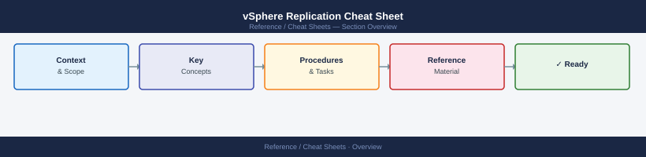

---
tags:
  - vsphere-replication
  - backup-dr
---
# vSphere Replication Cheat Sheet

<div class="kb-summary">
Top-10 vSphere Replication commands for replication configuration, status monitoring, and recovery via PowerCLI and VRMS REST API.
</div>



## PowerCLI

```powershell
Connect-VIServer vcenter.lab.local
Import-Module VMware.VimAutomation.Srm

# List replicated VMs and their status
Get-VM | Get-VrReplication                                                 # all VMs with replication
Get-VrReplication | Select VM, ReplicationState, RPO, LastReplicationTime  # status overview

# Configure replication on a VM
$vm = Get-VM -Name myvm
$target = Get-VrServer -Name vrms-target.lab.local
New-VrReplication -VM $vm -DestinationServer $target -RPO 60              # 60-min RPO

# Manage existing replication
Suspend-VrReplication -VM $vm                                              # pause replication
Resume-VrReplication -VM $vm                                               # resume replication
Remove-VrReplication -VM $vm                                               # remove replication config

# Recovery (failover to replica)
Start-VrRecovery -VM $vm -DestinationServer $target -Planned $true        # planned recovery
```

## VRMS REST API

```bash
BASE="https://vrms/api"
AUTH="-u administrator@vsphere.local:VMware1!"

curl -sk $AUTH $BASE/vms | python3 -m json.tool                            # replicated VMs
curl -sk $AUTH $BASE/vms/<id> | python3 -m json.tool                       # VM replication detail
curl -sk $AUTH $BASE/config | python3 -m json.tool                         # VRMS server config
curl -sk $AUTH $BASE/health | python3 -m json.tool                         # VRMS health status
```

## See also

- [vSphere Replication Operations](../../virtualization/vmware/vsphere-replication/operations/procedures/)
- [vSphere Replication Troubleshooting](../../virtualization/vmware/vsphere-replication/troubleshooting/common-issues/)
