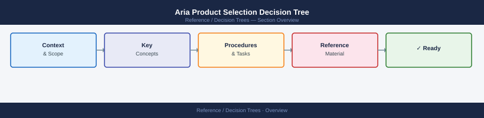
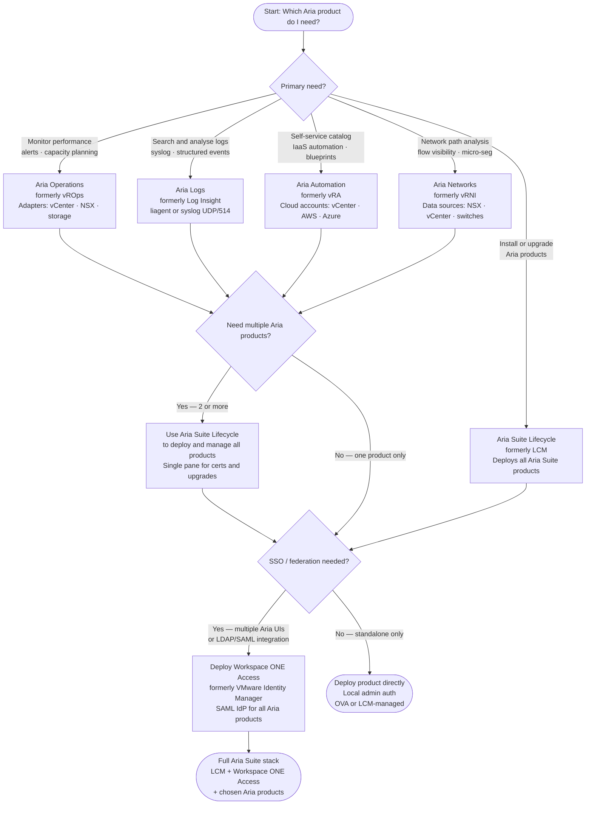

---
tags:
  - aria-operations
  - aria-logs
  - aria-automation
  - aria-networks
  - aria-suite-lifecycle
  - operations
---
# Aria Product Selection Decision Tree

<div class="kb-summary">
Choose the right Aria product for your need: performance monitoring, log management, infrastructure automation, network visibility, or lifecycle management of the Aria Suite itself.
</div>





```d2
direction: right

center: "Decision Trees" {shape: hexagon}
product_summary: "Product summary" {shape: rectangle}
deployment_order_when_installing_the: "Deployment order when installing the full suite" {shape: rectangle}

center -> product_summary
center -> deployment_order_when_installing_the
```

## Product summary

| Product | Purpose | Key API | Replaces |
|---|---|---|---|
| Aria Operations | Performance monitoring, alerting, capacity | `suite-api/api` | vRealize Operations (vROps) |
| Aria Logs | Log aggregation and search | REST `/api/v1` + liagent | vRealize Log Insight |
| Aria Automation | Self-service IaaS catalog | `/deployment/api` | vRealize Automation (vRA) |
| Aria Networks | Network visibility and path analysis | `/api/ni` | vRealize Network Insight (vRNI) |
| Aria Suite Lifecycle | Deploy and upgrade Aria Suite | `lcm/api/v2` | vRealize Suite Lifecycle Manager (LCM) |
| Workspace ONE Access | SSO and identity for Aria | SAML / LDAP | VMware Identity Manager (vIDM) |

## Deployment order when installing the full suite

1. **Workspace ONE Access** — must be first; all other products register with it for SSO
2. **Aria Operations** — connect vCenter and NSX adapters immediately after deploy
3. **Aria Logs** — configure liagent on VMs and forward vCenter/NSX syslog
4. **Aria Automation** — add vCenter and NSX cloud accounts after deploy
5. **Aria Networks** — add NSX and vCenter as data sources after deploy

All steps are orchestrated by **Aria Suite Lifecycle** when deploying via LCM.

## See also

- [Aria Operations Cheat Sheet](../cheat-sheets/aria-operations/)
- [Aria Logs Cheat Sheet](../cheat-sheets/aria-logs/)
- [Aria Automation Cheat Sheet](../cheat-sheets/aria-automation/)
- [Aria Networks Cheat Sheet](../cheat-sheets/aria-networks/)
- [Aria Suite Lifecycle Cheat Sheet](../cheat-sheets/aria-suite-lifecycle/)
- [Automation Interaction Map](../interaction-map/automation/)
- [Back to Decision Trees](index.md)
