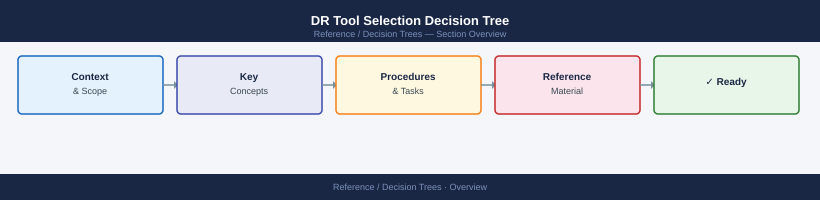
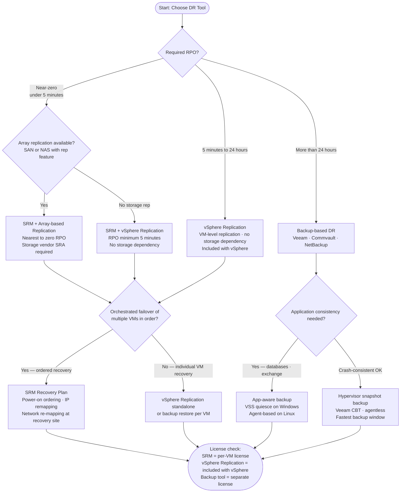

---
tags:
  - srm
  - vsphere-replication
  - backup-dr
  - architecture
---
# DR Tool Selection Decision Tree

Choose the right DR tool for your environment: SRM, vSphere Replication, or backup-based DR — based on RPO, RTO, application requirements, and licensing.

## Tool comparison

| Criterion | SRM | vSphere Replication | Backup-based DR |
|---|---|---|---|
| RPO | Near-zero (array) or 5 min+ | 5 min – 24 h | Hours – days |
| RTO | 15–30 min (automated) | 30–60 min (manual) | 1–4 h (restore) |
| Orchestration | Full (ordered, scripted) | None (manual per VM) | Limited |
| Cost | Per-VM license | Included in vSphere | Backup tool license |
| Storage dependency | Array SRA (array rep) or none (vSphere Rep) | None | None |
| App consistency | Via quiescing / scripts | Via quiescing | VSS / agents |

## Key constraints

- **SRM array-based replication** requires a Storage Replication Adapter (SRA) from the storage vendor — Pure Storage, NetApp, Dell all provide one.
- **vSphere Replication minimum RPO** is 5 minutes — there is no sub-5-minute option without array replication.
- **SRM without array replication** uses vSphere Replication as its replication engine — same 5-minute floor applies.
- **Backup-based DR** has no guaranteed RTO — restore time depends on data volume and network/storage throughput.
- For **Tier-1 databases**, combine SRM for failover orchestration with app-consistent snapshots from the backup tool.

## See also

- [SRM Cheat Sheet](../cheat-sheets/srm/)
- [vSphere Replication Cheat Sheet](../cheat-sheets/vsphere-replication/)
- [SRM Architecture](../../virtualization/vmware/srm/architecture/)
- [Back to Decision Trees](index.md)
